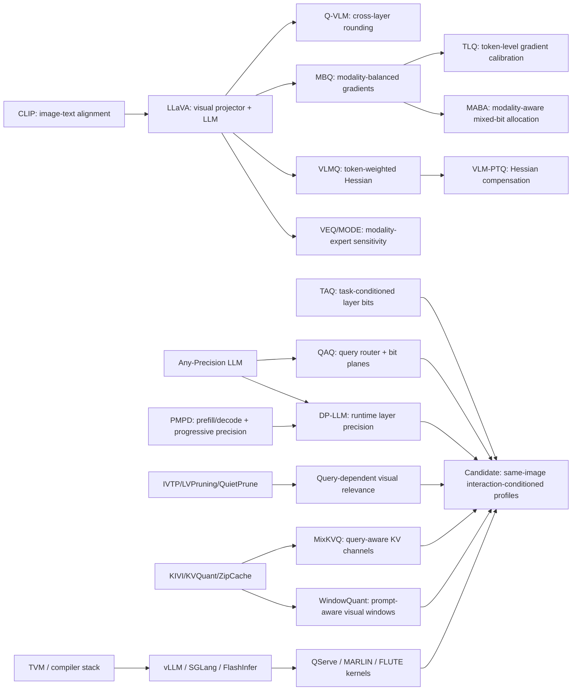

# Query-Aware Dynamic Precision for VLMs — Literature Review

> 检索截止：2026-09-05；范围：2021--2026（少量早期基础系统论文仅用于技术谱系）。
>
> 证据口径：优先会议官网、CVF/PMLR/ACL Anthology/OpenReview、arXiv 原文与官方代码。`arXiv`、`workshop`、`under review` 均不等同于正式主会录用。检索结论是截至日期内的证据结论，不是穷尽性“无人做过”证明。
>
> 迁移前本地材料审计：旧 `paper4/reference_papers_origin/`、`paper4/reference_papers_processed/` 和 `paper4/research/notes/` 在检索开始时只有 `.gitkeep`，没有可读取的 seed PDF 或笔记；因此以下 seed 均由一手公开来源核验。当前长期路径见 `paper4/CURRENT.md` 和根目录 `README.md`。

## 1. Executive Summary

### 1.1 Bottom line

**结论：CONDITIONAL GO，但必须改写题目和首创性叙述。** 宽泛的“Query-Aware Dynamic Mixed-Precision Quantization”已经发生直接碰撞，不能再声称首次提出：

- QAQ 已在 LLM 上用 query hidden representation 路由 bit-plane，按 query 选择精度；
- PAQ 已按 prompt 在多个量化模型之间路由；
- TAQ 已用 task-conditioned hidden statistics 做层级混合精度；
- DP-LLM 已按运行时输入、逐层且随 decode iteration 改变精度；
- MixKVQ 已直接提出 query-aware mixed-precision KV-cache quantization；
- WindowQuant 已以 visual-window/text-prompt similarity 决定视频 VLM 视觉窗口的 KV 位宽，并处理混合精度布局；
- PMPD 已明确区分 prefill/decode，并包含 task-/prompt-adaptive scheduler。

因此，候选论文不应把“query-aware”“dynamic”“mixed precision”三个词的组合本身当作 novelty。仍未被直接回答、且值得先做 canary 的问题是：

> **在同一图像、固定模型和相同量化预算下，只改变问题，VLM 的非 KV 模块（视觉编码器、projector、LLM attention/MLP）量化敏感度向量是否发生稳定、可预测、足以改变最优硬件 profile 的变化？**

该命题与“query 会改变 visual-token importance”不同：后者已有 QuietPrune、IVTP、LVPruning、SparseVLM 等大量证据；前者仍缺少严格的 same-image counterfactual study。它也与 WindowQuant/MixKVQ 不同：两者主要分配 KV 精度，而不是跨视觉编码器、projector、LLM 权重/激活的少量整图硬件 profile。

### 1.2 最大风险、最大 gap、推荐主线

- **最大 collision 风险**：QAQ + TAQ + DP-LLM 已覆盖 query/task/input-conditioned 权重精度的主要算法语言；MixKVQ + WindowQuant 已覆盖 query-conditioned KV precision；PMPD 覆盖 phase-aware/prompt-adaptive decoding；QUOTA/QAPruner/ZipVL 覆盖 pruning 与 quantization 的联合或串联。
- **最大证据 gap**：没有找到对同一 image 配置多类 query、逐模块施加量化扰动、比较敏感度向量并检验最优 precision profile 是否改变的受控实验。现有 query-guided token work 是强 motivation，但不是量化敏感度证据。
- **推荐主线**：**Counterfactual Image--Query Precision Profiling (CIQ-PP)**。先证明同图异问的 profile regret 确实存在，再设计一个只从廉价 image-query interaction 特征选择 3--4 个预打包、后端原生 profile 的 router。uncertainty rescue 只作为保险/消融，不作为独立 headline。
- **当前研究阶段**：Research Opportunity，**尚未达到 Paper Candidate**。缺少三项门禁证据：现象 canary、对 QAQ/TAQ/DP-LLM 适配版的 killer-baseline 增益、A800 wall-clock Pareto。

### 1.3 方向排序

1. **Direction A — Query-Aware Dynamic Precision（收缩后的 CIQ-PP）**：潜力最高，但碰撞高；只有 same-image/non-KV/profile-regret 命题被验证后才继续。
2. **Direction D — Uncertainty-Triggered Precision Rescue**：适合作为 A 的安全机制；级联与置信度重算思想并不新，独立成文风险较高。
3. **Direction B — Prefill/Decode Asymmetric Quantization**：工程友好，但 PMPD、LLM-PQ、MBQ 以及 KV 工作已覆盖核心思想；需加入 VLM 特有视觉 prefix 机制才可能成立。
4. **Direction C — Query-Aware Visual Token + Precision Co-Design**：token query-awareness 证据最强，却已有 QUOTA、QAPruner、Bi-VLM、ZipVL 等直接组合，最容易退化为模块拼接。

## 2. Seed Papers and Technical Lineage

### 2.1 Seed audit

本地没有 seed 原文或笔记。检索到的命名中，`Q-VLM`、`VLMQ`、`TLQ`、`VEQ`、`LQA`、`QuantX` 均可对应到论文；`TVM` 是编译系统基础工作而不是 VLM 量化算法。CLIP/LLaVA 定义了模态对齐和视觉 prefix 进入语言模型的基本接口。

### 2.2 技术演化图

谱系揭示了三个边界：

1. VLM PTQ 从“整模均匀”发展到 modality/token/Hessian-aware，但绝大多数仍在 calibration 后冻结；
2. 动态精度在 CNN/ViT/LLM 已成熟到 sample/token/decode-step 粒度，VLM 不能忽略这些迁移先例；
3. query-conditioned visual relevance 已被 token pruning 证实，query-conditioned precision 在 LLM/KV 上也已出现；剩余空间必须是二者尚未覆盖的 VLM 交互敏感度、离散 profile 决策和真实后端闭环。

### 2.3 Search and citation-chaining protocol

- 对 Q-VLM、MBQ、VLMQ、TLQ、VEQ、QAQ、TAQ、DP-LLM、PMPD、KIVI、KVQuant、WindowQuant、QuietPrune 做 backward chaining：核对 related work、方法所依赖的 sensitivity/quantizer/runtime；对 Q-VLM、MBQ、KIVI、FastV 等较早 seed 做 forward chaining，定位 VLM-PTQ/MABA、MixKVQ/WindowQuant、SparseVILA/QuietPrune 等后续工作。
- keyword matrix 同时交叉 `VLM/LVLM/LLM/ViT/MoE` × `quantization/mixed precision/KV/token pruning/routing/calibration` × `query/task/input/sample/token/modality/confidence/hardware-aware`，并额外执行第 5 节列出的 exact-phrase collision queries。
- 邻域迁移优先检查 CNN/ViT 的 instance-aware bit controller、LLM 的 elastic precision/query routing、MoE 的 expert bits，以及 serving/compiler 的 packing/batching/graph 约束。
- 去重以最终论文标题和主版本为单位；正式会议版本优先于同一 arXiv。只发现摘要级信息或 venue 未确认时，表中明确标成 preprint/workshop/`unverified`。

## 3. Taxonomy of Related Work

### A. VLM / LVLM quantization（表中 19 篇，含 2 篇架构 seed；量化论文 17 篇）

主流方法以固定校准集估计 rounding、梯度、Hessian、模态失衡、token 权重或 expert 频率，部署时 policy 固定。MBQ/MABA/VLMQ/TLQ/VEQ 已使“modality-aware”“token-aware calibration”“Hessian/gradient importance”“expert-aware bit allocation”本身不再新。少数论文报告真实 GPU kernel，但没有证明按当前 image-query interaction 切换完整 VLM profile。

### B. LLM / Transformer dynamic and mixed precision（至少 16 篇）

粒度已覆盖 layer、block、sample、token、decode iteration 和 whole-prompt。最危险近邻是 QAQ、PAQ、TAQ、DP-LLM、PMPD；Any-Precision 与 QuEPT 提供单份权重支持多位宽的实现基础。新的 VLM 方法必须在视觉交互机制和硬件部署上与它们区分。

### C. Query/task/input-adaptive inference（本类与 B/D 重叠，共 18 篇）

early exit、dynamic depth、query routing、test-time compute scaling 已表明输入难度可以条件化计算量。它们支持“异质 query 值得不同预算”，但不证明量化噪声的最优位置也随 query 改变。

### D. Visual token pruning/selection（13 篇）

IVTP、LVPruning、QuietPrune、SparseVLM 等明确使用 instruction/query-to-vision relevance；SparseVILA 又指出多轮场景中按首问永久删除视觉 token 会损害未来 query。结论是 visual-token importance 随 query 变化有强证据，但简单地“prune 后 quantize”已经碰撞。

### E. KV cache / prefill / decode quantization（至少 17 篇）

KIVI/KVQuant 奠定 K per-channel、V per-token；MiKV/ZipCache/Cocktail/PM-KVQ 引入 token/chunk/block mixed precision；PMPD 做 phase-aware weight precision；MixKVQ 和 WindowQuant 构成 query-aware KV 的直接碰撞。VLM 视觉 prefix 的专门工作仍少，但并非空白。

### F. MoE routing + quantization（10 篇，含 VEQ）

已有依据包括专家激活频率、token-expert affinity、Hessian trace、router 扰动、专家重要性和硬件 GroupGEMM。VEQ 之后仍可能研究“同一图像不同 query 导致的 expert route 与量化脆弱性耦合”，但主线不应从 30B+ MoE 开始。

### G. Hardware/compiler-aware quantization（10 篇）

TVM、vLLM、SGLang、FlashInfer 描述编译、批处理、KV 管理和 kernel 调度约束；Atom/QServe/MARLIN/FLUTE/QFactory 说明低 bit 只有在 packing、dequantization 和 kernel 融合匹配时才会成为 wall-clock 收益。动态 profile 数量必须极少、布局预打包，且最好仅在 request/phase 边界切换。

### H. Distribution shift / TTA / robustness（10 篇）

TPT、C-TPT、ZERO、TDA、RLCF 证明 entropy/confidence/cache 可在测试时适配 VLM；量化置信度研究显示低置信样本更容易被量化伤害。但 uncertainty 是不完美代理，若 rescue 需要完整低精度生成后再重算，期望成本可能超过直接高精度。

## 4. Core Literature Table

说明：共 **100 篇唯一论文/正式系统论文**，没有把 arXiv 与会议版本重复计数。`A--H` 对应第 3 节；一篇可跨类。硬件栏的“否”表示未见端到端真实 latency/throughput 证据，不等于作者完全没有报告显存。结果为论文自报，尚非本仓库复现。

| ID / Cat. | Paper | Year | Venue | Model | Problem | Core Idea | Granularity | Static or Dynamic | Quantization | Hardware Eval | Main Result | Relevance | Collision Risk | Reusable Insight | Missing Piece | Code | URL |
|---|---|---:|---|---|---|---|---|---|---|---|---|---|---|---|---|---|---|
| 1 A | Learning Transferable Visual Models From Natural Language Supervision (CLIP) | 2021 | ICML | CLIP | Open-vocabulary visual representation | Contrastive image-text pretraining | sample/pair | static inference | none | yes, scale only | Strong zero-shot transfer | Image-query feature basis | Low | Cheap cross-modal similarity features | No LVLM generation/quantization | [GitHub](https://github.com/openai/CLIP) | [PMLR](https://proceedings.mlr.press/v139/radford21a.html) |
| 2 A | Visual Instruction Tuning (LLaVA) | 2023 | NeurIPS | LLaVA | Connect vision encoder to LLM | Linear projector + visual instruction tuning | modality/token | static inference | none | limited | Establishes LVLM architecture | Primary target lineage | Low | Separates vision/projector/LLM | No quantization | [GitHub](https://github.com/haotian-liu/LLaVA) | [arXiv](https://arxiv.org/abs/2304.08485) |
| 3 A | Q-VLM: Post-training Quantization for Large Vision-Language Models | 2024 | NeurIPS | LLaVA, MoE-LLaVA | Low-bit VLM PTQ | Cross-layer block reconstruction/rounding with activation-entropy proxy | layer/block | calibration-time; fixed runtime | weight-only low bit | yes | Reports 2.78x memory reduction and 1.44x generation speedup | Seed static baseline | Medium | Cross-layer error compensation | No current-query policy | [GitHub](https://github.com/ChangyuanWang17/QVLM) | [NeurIPS](https://proceedings.neurips.cc/paper_files/paper/2024/hash/cffbaf4f47546ece96bb42c0edda40ee-Abstract-Conference.html) |
| 4 A/G | MBQ: Modality-Balanced Quantization for Large Vision-Language Models | 2025 | CVPR | LLaVA-OneVision etc. | Text tokens dominate calibration gradients | Balance visual/language gradient sensitivity | modality/channel | calibration-time; fixed | W3A16, W4A8 | yes; RTX 4090 fused W3 | Up to 4.4/11.6 points over compared baselines; 1.4x generation report | Killer static baseline | High | Modality-balanced calibration; real kernel | No query-instance variation | [GitHub](https://github.com/thu-nics/MBQ) | [CVF](https://openaccess.thecvf.com/content/CVPR2025/html/Li_MBQ_Modality-Balanced_Quantization_for_Large_Vision-Language_Models_CVPR_2025_paper.html) |
| 5 A | VLMQ: Enhancing Vision-Language Models via High-Order Optimization Quantization | 2025 | arXiv | LVLM 0.5B--32B | Low-bit PTQ error | Token-importance augmented Hessian; block-wise backward | token/block | calibration-time; fixed | down to W2 | no end-to-end kernel evidence | Reports +16.45% on MME-RealWorld at 2 bit in one setting | Hessian killer baseline | High | Token-weighted curvature | No runtime query conditioning | — | [arXiv](https://arxiv.org/abs/2508.03351) |
| 6 A | Rethinking Practical and Efficient Quantization Calibration for Vision-Language Models (TLQ) | 2026 | arXiv | LVLMs | Expensive/coarse VLM calibration | Token-level gradient importance and exposed-layer calibration | token/layer | calibration-time; fixed | weight PTQ | calibration efficiency, not runtime | Reports stronger low-bit accuracy with practical multi-GPU calibration | Seed direct neighbor | High | Token-level gradient statistic | Not same-image query-adaptive; preprint | code announced | [arXiv](https://arxiv.org/abs/2602.07899) |
| 7 A | VLM-PTQ: Efficient Post-Training Quantization for Large Vision-Language Models | 2026 | CVPR | 1B--72B LVLMs | 2--4 bit VLM degradation | Closed-form asymmetric weight compensation + modality-aware Hessian | channel/block | calibration-time; fixed | W3A16, W2A16, W4A8, W4A4 | limited latency | Strong across scales/bit settings | Strongest static PTQ family | High | Residual/Hessian correction | No runtime profiles | — | [CVF](https://openaccess.thecvf.com/content/CVPR2026/html/Deng_VLM-PTQ_Efficient_Post-Training_Quantization_for_Large_Vision-Language_Models_CVPR_2026_paper.html) |
| 8 A/G | Modality-Aware Bit Allocation for Mixed-Precision Quantization of VLMs (MABA) | 2026 | CVPR Findings | LLaVA-OneVision | Uniform bits waste precision | Gradient-guided modality/group allocation under memory/latency budget | group/layer/modality | calibration-time; fixed | 2/3/4-bit W | yes; fused GEMV | Up to 2.3 points over uniform; large GEMVs 2.7--4.2x vs FP16 | Closest static mixed-bit VLM | High | At most two bits/layer avoids fragmentation | No per-query allocation | [GitHub](https://github.com/xzhang9308/MABA) | [CVF](https://openaccess.thecvf.com/content/CVPR2026F/html/Zhang_Modality-Aware_Bit_Allocation_for_Mixed-Precision_Quantization_of_Vision-Language_Models_CVPRF_2026_paper.html) |
| 9 A/F | VEQ: Modality-Adaptive Quantization for Mixture-of-Experts Vision-Language Models | 2026 | arXiv | Kimi-VL, Qwen3-VL MoE | Expert heterogeneity under VLM PTQ | Modality-expert frequency + token-expert affinity Hessian | expert/modality | calibration-time; fixed | W3A16 | no | Reports +2.04/+3.09 average over compared W3 baselines | MoE extension collision | High | Couple routing statistics to bits | Not current-query runtime routing | code announced | [arXiv](https://arxiv.org/abs/2602.01037) |
| 10 A/H | LQA: Lightweight Quantized-Adaptive CLIP for Edge Deployment | 2026 | arXiv | CLIP | Quantized VLM under shift | Vision 4-bit/text 8-bit selective hybrid quantization + cache TTA | modality/layer/sample | fixed quant.; dynamic TTA | W4 vision/W8 text hybrid | memory/runtime reported | Reports +4.5% adaptation and up to 19.9x memory reduction | Rescue/TTA neighbor | Medium | Separate static compression from online adaptation | No generative LVLM/query bit switch | — | [arXiv](https://arxiv.org/abs/2602.07849) |
| 11 A/G | QuantX: A Framework for Quantization-Aware Optimization of LLMs and VLMs | 2025 | arXiv | LLM/LLaVA | Choose hardware-aware quant recipe | Meta-optimization over precision/quantizer choices | model/layer | offline; fixed | 2--8-bit recipes | yes | LLaVA-1.6 3-bit reportedly within 6% of FP | Hardware-aware static baseline | Medium | Optimize Pareto, not bits alone | No per-query switching | — | [arXiv](https://arxiv.org/abs/2505.07531) |
| 12 A/D | Bi-VLM: Pushing the Limit of Low-Bit Vision-Language Models | 2025 | arXiv | LVLMs | Extreme <=2-bit failure and token redundancy | Saliency-aware hybrid Gaussian quantiles plus token pruning | channel/token | offline; fixed | <=2-bit | limited | Reports broad gains and 90--99% visual-token redundancy | Joint compression collision | High | Quant error and token saliency interact | Query-specific benefit not isolated | — | [arXiv](https://arxiv.org/abs/2509.18763) |
| 13 A | SPEED-Q: Staged Sensitivity-Aware Quantization for Small VLMs | 2025 | arXiv | small VLM | On-device low-bit accuracy | Staged sensitivity selection and distillation | module/layer | training/calibration; fixed | low-bit W/A | edge-oriented | Reports improved low-bit small-VLM deployment | Small-model baseline | Medium | Stage canary from cheap sensitivity | No image-query dynamic policy | — | [arXiv](https://arxiv.org/abs/2511.08914) |
| 14 A | Towards Understanding Best Practices for Quantization of Vision-Language Models | 2026 | arXiv | ViT/projector/LLM VLMs | Component-wise quantization behavior | Systematic component/method analysis | component | static evaluation | GPTQ/AWQ and variants | some deployment study | Finds component and architecture sensitivity differ | Design/measurement baseline | Medium | Must ablate vision/projector/LLM | No new dynamic allocator | [GitHub](https://github.com/gautomdas/mmq) | [arXiv](https://arxiv.org/abs/2601.15287) |
| 15 A | ZGO-SLQ: Accurate Quantization for LVLMs via Zeroth-Order Gradient Optimization and Sectioned Logarithmic Quantizer | 2026 | ICASSP | LVLMs | Modality-sensitive low-bit W/A | Zeroth-order calibration + sectioned log quantizer | channel/module | calibration-time; fixed | low-bit W/A | no clear E2E | Reports accuracy recovery at low bits | Quantizer/calibration baseline | Medium | Gradient-free optimization | No dynamic precision | — | [IEEE DOI](https://doi.org/10.1109/ICASSP55912.2026.11460568) |
| 16 A | Vision Vulnerability Score-Guided PTQ for VLMs (VVSQ) | 2026 | Neurocomputing, online/in press | LVLMs | Locate layers vulnerable to visual/text quantization | Vision/language vulnerability scores guide precision | layer/modality | calibration-time; fixed | mixed precision PTQ | no clear E2E | Reports better low-bit task retention | Direct layer-allocation neighbor | High | Separate dual-modality vulnerability | No per-query policy | — | [ScienceDirect](https://www.sciencedirect.com/science/article/pii/S0925231226022861) |
| 17 A | Learning to Prompt for Quantization in Visual-Language Models (P4Q) | 2024 | OpenReview submission; acceptance unverified | CLIP-like VLM | Repair quantized VLM quality | Learn quantization-oriented prompts/contrastive objective | prompt/model | training-time; fixed | PTQ-assisted | no | Submission reports accuracy recovery | Terminology collision only | Medium | Prompt can calibrate quantization | Prompt is learned repair, not user-query precision | — | [OpenReview](https://openreview.net/forum?id=7lmvCdD6va) |
| 18 A/F | Quant Experts: Token-aware Adaptive Error Reconstruction with Mixture of Experts for LVLM Quantization | 2026 | CVPR | LVLM | Quantization residual is token heterogeneous | Route tokens to expert residual correctors | token/expert | runtime routing; fixed base quant | low-bit + correction experts | limited | Reports better low-bit reconstruction | Runtime token-adaptive neighbor | High | Lightweight routed correction alternative to bit switch | Added experts, not precision allocation | — | [CVF PDF](https://openaccess.thecvf.com/content/CVPR2026/papers/Jia_Quant_Experts_Token-aware_Adaptive_Error_Reconstruction_with_Mixture_of_Experts_CVPR_2026_paper.pdf) |
| 19 A | QSVD: Efficient Low-rank Approximation for Unified QKV Weight Compression in Low-Precision VLMs | 2025 | NeurIPS | VLM | QKV low-rank compression under low precision | Joint QKV low-rank factorization suited to quantization | module/rank | offline; fixed | low-precision QKV | limited | Reports better QKV compression-quality tradeoff | Attention-module baseline | Medium | Q/K/V errors should not be isolated | No query-conditioned rank/bit | — | [NeurIPS](https://proceedings.neurips.cc/paper_files/paper/2025/hash/028ef7e68a5ea25fc26cd6abf3a5c147-Abstract-Conference.html) |
| 20 B/C | QAQ: Query-adaptive Mixed-precision Quantization for Large Language Models | 2025 | NeurIPS ML for Systems Workshop | Qwen3, Llama-3.1 | Static precision ignores heterogeneous queries | Bit-plane weights + hidden-query MLP router + on-demand CPU/GPU loading | query/block | runtime | variable weight bits | yes; overhead acknowledged | Matches reported 8-bit quality with lower GPU memory, but adds latency | **Direct algorithm collision** | High | Nested bit-planes avoid full copies | No visual interaction; workshop evidence | — | [NeurIPS workshop](https://neurips.cc/virtual/2025/129098) |
| 21 B/C | Prompt-Adaptive Quantization: Adaptive Per-Prompt Routing for Efficient LLM Inference (PAQ) | 2025 | OpenReview; venue status unverified | LLM | Different prompts need different precision | ModernBERT-like router selects prequantized 2/4/8/16-bit model | prompt/model | runtime per request | whole-model tiers | latency/memory reported | Reports prompt-wise accuracy-cost gains | **Direct whole-profile collision** | High | Request-boundary routing is batchable | Multiple model copies; no vision | — | [OpenReview PDF](https://openreview.net/pdf/0457c8208adfaf621ea17bd68f49c07e53e9c095.pdf) |
| 22 B/C | You Had One Job: Per-Task Quantization Using LLM Hidden Representations (TAQ) | 2026 | ICML AdaptFM Workshop / arXiv | Phi-4, Llama/Qwen | Task-agnostic PTQ misallocates bits | Hidden-information/stability or KL sensitivity from unlabeled task prompts | task/layer | task calibration; fixed per task | weight-only mixed precision | yes | Reports large gains over AWQ in selected low-bit tasks | **Direct task-aware collision** | High | Task profiles may be stable/reusable | Not per-instance; no image-query pair | — | [arXiv](https://arxiv.org/abs/2511.06516) |
| 23 B/C | DP-LLM: Runtime Model Adaptation with Dynamic Layer-wise Precision Assignment | 2025 | arXiv/OpenReview | Llama-3 8B, Phi-3 Medium | Layer sensitivity changes over decode iterations | Per-linear lightweight error estimator chooses bit width from input | layer/token-step | runtime | dynamic weight bits | Jetson Orin, RTX 4060 Ti | Reports superior quality-latency frontier | **Direct runtime layer collision** | High | Step-wise sensitivity and nested weights | No visual path; selector cost/kernels critical | — | [arXiv](https://arxiv.org/abs/2508.06041) |
| 24 B/C/E | Progressive Mixed-Precision Decoding for Efficient LLM Inference (PMPD) | 2025 | ICLR | LLM | Uniform precision across generation wastes compute | High-precision prefill, progressively lower decode; task/prompt schedulers | phase/decode-step | runtime | multiple weight precisions | yes; GPU/NPU kernels | Reports 1.4--12.2x matvec vs FP16 and up to 1.54x over uniform | Direct B collision | High | Phase boundary is hardware friendly | Not VLM visual prefix | — | [ICLR](https://proceedings.iclr.cc/paper_files/paper/2025/hash/5df4313ecd4875931fbdacc486cc1fcf-Abstract-Conference.html) |
| 25 B/G | Any-Precision LLM: Low-Cost Deployment of Multiple, Different-Sized LLMs | 2024 | ICML Oral | LLM | Store/serve many bit widths cheaply | Incrementally upscale quantized model; overlaid storage + engine | model/layer | runtime selectable | 3...n-bit weights | yes; custom engine | One n-bit-size footprint serves several precisions with strong throughput | Enabling substrate | High | Nested representations for profile switching | No input policy | [GitHub](https://github.com/SNU-ARC/any-precision-llm) | [PMLR](https://proceedings.mlr.press/v235/park24e.html) |
| 26 B/C | Mixture-of-Bits Quantization for Token-Adaptive Elastic LLMs (MoBiQuant) | 2026 | arXiv/workshop | LLM | Token sensitivity is heterogeneous | Recursive residual bit slices + token-aware router | token/layer | runtime | elastic weight bits | limited | Reports elastic quality-efficiency tradeoff | Token-wise collision | High | Residual slices permit reuse | Preprint/workshop; no multimodal evidence | — | [arXiv](https://arxiv.org/abs/2602.20191) |
| 27 B | LSAQ: Layer-Specific Adaptive Quantization for LLM Deployment | 2024 | arXiv | LLM | Layers have different sensitivity/resources | Layer scoring and hardware-budget bit assignment | layer | offline/reconfigured | mixed weight bits | limited | Reports better accuracy-size tradeoff | Static killer baseline | Medium | Resource-constrained allocation | Not input/query adaptive | — | [arXiv](https://arxiv.org/abs/2412.18135) |
| 28 B/E/G | LLM-PQ: Serving LLM on Heterogeneous Clusters with Phase-Aware Partition and Adaptive Quantization | 2024 | arXiv | LLM | Cluster placement and phase cost | Joint partition, placement, prefill/decode-aware quantization | layer/device/phase | offline per deployment | mixed W/A | yes | Reports latency/cost gains on heterogeneous clusters | System/phase baseline | Medium | Precision decision must include placement | Not semantic query-conditioned | — | [arXiv](https://arxiv.org/abs/2403.01136) |
| 29 B/C | Instance-Aware Dynamic Neural Network Quantization | 2022 | CVPR | CNN | Image difficulty differs | Controller emits per-image, per-layer bits | sample/layer | runtime | dynamic W/A bits | mobile-oriented latency proxy | Better accuracy-cost tradeoff than static quantization | Closest classical transfer | High | Explicit same-input controller design | CNN classification; retraining/hardware gap | [GitHub](https://github.com/huawei-noah/Efficient-Computing) | [CVF](https://openaccess.thecvf.com/content/CVPR2022/html/Liu_Instance-Aware_Dynamic_Neural_Network_Quantization_CVPR_2022_paper.html) |
| 30 B/C | IGQ-ViT: Instance-Aware Group Quantization for Vision Transformers | 2024 | CVPR | ViT | Activation/softmax distribution changes by image | Dynamic grouping of channels/attention values per instance | sample/group | runtime statistics | low-bit activation/softmax | latency reported | Strong low-bit ViT accuracy | Vision-side transfer | Medium | Input-specific grouping without semantic labels | Not LVLM/query; bit budget mostly fixed | — | [CVF PDF](https://openaccess.thecvf.com/content/CVPR2024/papers/Moon_Instance-Aware_Group_Quantization_for_Vision_Transformers_CVPR_2024_paper.pdf) |
| 31 B/C | USDN: A Unified Sample-Wise Dynamic Network With Mixed-Precision and Early-Exit | 2024 | WACV | CNN | Joint depth/precision per sample | Groups layers by complexity; jointly select exit and bit configuration | sample/group | runtime path | mixed precision | compute proxy | 12.78% lower compute than compared prior work with higher accuracy | Sample-wise precedent | High | Joint resource decisions beat isolated ones | Classification/training-specific | — | [CVF](https://openaccess.thecvf.com/content/WACV2024/html/Jeon_USDN_A_Unified_Sample-Wise_Dynamic_Network_With_Mixed-Precision_and_Early-Exit_WACV_2024_paper.html) |
| 32 B/C | Bit-Mixer: Mixed-Precision Networks with Runtime Bit-Width Selection | 2021 | CVPR | CNN | One model serving multiple runtime bits | Train shared weights for runtime layer bit choices | layer/runtime constraint | runtime | multiple W/A bits | hardware proxy | Competitive accuracy across selectable budgets | Foundational dynamic-bit prior | High | Shared weights reduce storage | Not PTQ/Transformer/VLM | — | [arXiv](https://arxiv.org/abs/2103.17267) |
| 33 B/G | ScaleBITS: Scalable Bitwidth Search for Hardware-Aligned Mixed-Precision LLMs | 2026 | arXiv | LLM | Fine-grained allocation is costly/irregular | Hardware-aligned blocks, channel reorder, scalable knapsack approximation | block/channel | offline; fixed | mixed low-bit weights | hardware-aligned evaluation | Reports up to +36% vs uniform, no runtime selector overhead | Killer static allocator | High | Hardware alignment and global budget | No input adaptation | — | [arXiv](https://arxiv.org/abs/2602.17698) |
| 34 B/C | Dynamic Mixed-Precision Routing for Efficient Multi-step LLM Interaction | 2026 | arXiv | LLM agents | Agent steps have different precision sensitivity | KL-supervised then GRPO router selects high/low precision each step | interaction step | runtime | two model precision tiers | cost/latency evaluation | Better success-cost frontier on ALFWorld | Rescue/routing collision | High | Precision-sensitive step labels from KL | Agent setting; two full variants | — | [arXiv](https://arxiv.org/abs/2602.02711) |
| 35 B/G | QuEPT: Quantized Elastic Precision Transformers with One-Shot Calibration for Multi-Bit Switching | 2026 | AAAI | Transformer/LLM | Expensive multi-bit preparation | One-shot calibration for elastic bit switching | layer/model | runtime selectable | multi-bit | system-oriented | Reports competitive multi-bit quality with low preparation cost | Runtime substrate | Medium | Shared calibration across profiles | No query policy/VLM | — | [AAAI PDF](https://ojs.aaai.org/index.php/AAAI/article/download/39945/43906) |
| 36 C | You Need Multiple Exiting: Dynamic Early Exiting for Unified Vision-Language Model | 2023 | CVPR | unified V-L Transformer | Inputs need different depth | Multiple exits and dynamic confidence-based stopping | sample/layer | runtime | none | latency/FLOPs | Accelerates V-L tasks with adaptive depth | VLM adaptive-compute prior | High | Query/task complexity changes useful depth | Precision not studied | — | [Google Research](https://research.google/pubs/you-need-multiple-exiting-dynamic-early-exiting-for-accelerating-unified-vision-language-model/) |
| 37 C | Confident Adaptive Language Modeling (CALM) | 2022 | NeurIPS | Transformer LM | Easy tokens do not need all layers | Confidence-based early exit with calibrated thresholds | token/layer | runtime | none | latency/compute | Reports potential speedup up to 3x with sequence-level guarantees | D confidence precedent | Medium | Calibrate confidence against risk | No quantization/vision | — | [NeurIPS](https://proceedings.neurips.cc/paper_files/paper/2022/hash/6fac9e316a4ae75ea244ddcef1982c71-Abstract-Conference.html) |
| 38 C | Mixture-of-Depths: Dynamically Allocating Compute in Transformer-Based Language Models | 2024 | arXiv | Transformer LM | Fixed depth spends equal compute per token | Learned top-k token routing through blocks under fixed budget | token/layer | runtime | none | compute/throughput | Competitive quality with lower FLOPs | Token compute-allocation prior | Medium | Budgeted conditional computation | Training architecture; no PTQ | — | [arXiv](https://arxiv.org/abs/2404.02258) |
| 39 C | RouterDC: Query-Based Router by Dual Contrastive Learning for Assembling LLMs | 2024 | NeurIPS | multiple LLMs | Route queries to suitable model | Dual-contrastive query/model router | query/model | runtime | none | serving cost proxy | Reports +2.76% in-distribution and +1.90% OOD over compared routing setting | Query encoder baseline | Medium | Router must generalize across tasks | Routes models, not precision/modules | [GitHub](https://github.com/shuhao02/RouterDC) | [NeurIPS](https://proceedings.neurips.cc/paper_files/paper/2024/hash/7a641b8ec86162fc875fb9f6456a542f-Abstract-Conference.html) |
| 40 C | Hybrid LLM: Cost-Efficient and Quality-Aware Query Routing | 2024 | arXiv | small/large LLM | Query difficulty varies | Predict whether small model suffices | query/model | runtime | none | cost/latency | Better quality-cost tradeoff than one model | Whole-request oracle baseline | Medium | Define router regret/cost | No intra-model precision | — | [arXiv](https://arxiv.org/abs/2404.14618) |
| 41 C | Scaling LLM Test-Time Compute Optimally Can Be More Effective than Scaling Model Parameters | 2024 | arXiv | LLM | Test-time compute should depend on problem | Difficulty-aware proposal/verifier budget | query/sample | runtime | none | compute scaling | Shows allocation policy matters by difficulty | Motivation for heterogeneous budget | Low | Oracle headroom before router | No VLM/quantization | — | [arXiv](https://arxiv.org/abs/2408.03314) |
| 42 C | Strategic Scaling of Test-Time Compute | 2026 | ICLR | reasoning LLM | Fixed inference budget is suboptimal | Per-query bandit/strategy for test-time budget | query | runtime | none | cost-quality | Reports better budget allocation than uniform scaling | Query budget methodology | Medium | Evaluate oracle/learned router regret | No precision or vision | — | [ICLR](https://proceedings.iclr.cc/paper_files/paper/2026/hash/d8d2c5f79c53a2a685dbdf93f78c5695-Abstract-Conference.html) |
| 43 C/G | HELIOS: Heterogeneous LLM Inference via Offline Profiling and Online Scheduling | 2026 | MLSys | LLM serving | Requests/hardware conditions differ | Profile-guided online scheduling across execution modes | request/device | runtime | may include precision modes | yes | Reports serving Pareto gains | Batch/scheduler baseline | Medium | System policy must include queue/batch | Semantic image-query sensitivity absent | — | [MLSys](https://proceedings.mlsys.org/paper_files/paper/2026/hash/096b1019463f34eb241e87cfce8dfe16-Abstract-Conference.html) |
| 44 C/D | QuietPrune: Query-Guided Early Token Pruning for Vision-Language Models | 2026 | CVPR | Qwen3-VL, InternVL3 | Early visual tokens lack query context | Inverse projector forms visual-domain query CLS; grouped relevance pruning | query/visual token | runtime | none | yes | Up to 19% prefill latency reduction and +4.2 accuracy vs late pruning | Strongest query-dependence evidence | High | Cheap image-query interaction score | Token relevance != quant sensitivity | — | [CVF](https://openaccess.thecvf.com/content/CVPR2026/html/Gao_QuietPrune_Query-Guided_Early_Token_Pruning_for_Vision-Language_Models_CVPR_2026_paper.html) |
| 45 C/D | Instruction-Guided Visual Token Pruning for Accelerating LVLMs (IVTP) | 2024 | ECCV | LLaVA-like | Query-irrelevant visual tokens waste compute | Instruction-to-visual relevance selects tokens | query/token | runtime | none | FLOPs/latency | Maintains quality at substantial token reduction | Direct motivation | High | Same image can need different regions | No quantized execution | — | [ECCV PDF](https://www.ecva.net/papers/eccv_2024/papers_ECCV/papers/02577.pdf) |
| 46 C/D | LVPruning: An Effective yet Simple Language-Guided Vision Token Pruning Method for LVLMs | 2025 | Findings NAACL | LVLM | Vision tokens differ in language relevance | Language-guided layer/token scoring | query/token/layer | runtime | none | efficiency reported | Strong pruning-quality frontier | Query relevance evidence | High | Layer and query jointly condition importance | No precision allocation | — | [ACL PDF](https://aclanthology.org/anthology-files/pdf/naacl/2025.naacl-findings.242.pdf) |
| 47 D | An Image is Worth 1/2 Tokens After Layer 2 (FastV) | 2024 | ECCV Oral | LLaVA/QwenVL/Video-LLaVA | Deep layers underuse visual tokens | Early-attention-based visual token pruning after layer 2 | token/layer | runtime | none | FLOPs; implementation | Reports 45% FLOPs reduction on LLaVA-1.5-13B without loss | Strong simple pruning baseline | Medium | Attention can proxy token importance | Early score may be query brittle | [GitHub](https://github.com/pkunlp-icler/FastV) | [ECCV PDF](https://www.ecva.net/papers/eccv_2024/papers_ECCV/papers/10478.pdf) |
| 48 C/D | SparseVLM: Visual Token Sparsification for Efficient VLM Inference | 2025 | ICML | LVLM | Redundant visual prefix | Text-relevance-aware adaptive pruning and token recycling | query/token/layer | runtime | none | latency/memory | Reports 54% FLOPs and 37% CUDA-time reductions while retaining 97% accuracy in a cited setting | Killer token baseline | High | Recycle discarded information | No bit allocation | [GitHub](https://github.com/Gumpest/SparseVLMs) | [PMLR](https://proceedings.mlr.press/v267/zhang25s.html) |
| 49 D | VisionZip: Longer Is Better but Not Necessary in Vision-Language Models | 2025 | CVPR | LVLM | Long visual token sequence | Select dominant tokens and merge contextual tokens | visual token | runtime, query-agnostic | none | yes | Reports large prefill acceleration, including about 8x settings | Strong query-agnostic baseline | Medium | Separate dominant/context tokens | Does not adapt to question | [GitHub](https://github.com/dvlab-research/VisionZip) | [CVF](https://openaccess.thecvf.com/content/CVPR2025/html/Yang_VisionZip_Longer_is_Better_but_Not_Necessary_in_Vision_Language_CVPR_2025_paper.html) |
| 50 D | PyramidDrop: Accelerating Your Large Vision-Language Models via Pyramid Visual Redundancy Reduction | 2024 | arXiv | LVLM | Visual redundancy grows with depth | Progressive layer-wise token dropping | token/layer | fixed schedule at runtime | none | FLOPs/training time | Reports ~40% training and ~55% inference FLOPs reduction | Static pruning baseline | Medium | Depth-dependent visual needs | No current-query decision | — | [arXiv](https://arxiv.org/abs/2410.17247) |
| 51 D | FasterVLM: You Need Fewer Visual Tokens Than You Think | 2024 | arXiv | LVLM | Attention-based pruning can be biased | Vision-encoder CLS attention selects tokens before LLM | visual token | runtime, query-agnostic | none | efficiency | Reports retaining ~90% performance after 95% pruning in selected settings | Strong cheap baseline | Medium | Query-free saliency avoids late compute | Cannot adapt to question | — | [arXiv](https://arxiv.org/abs/2412.01818) |
| 52 C/D | SparseVILA: Decoupling Visual Sparsity for Efficient VLM Inference | 2025 | ICCV | VILA/multi-turn VLM | First-query pruning harms later turns | Query-agnostic prefill compression + query-aware decode sparsity | turn/token/phase | runtime | none | yes | Shows avoiding re-prefill improves multi-turn efficiency | Important boundary evidence | High | Separate persistent visual cache from current-query compute | No quant precision | — | [CVF PDF](https://openaccess.thecvf.com/content/ICCV2025/papers/Khaki_SparseVILA_Decoupling_Visual_Sparsity_for_Efficient_VLM_Inference_ICCV_2025_paper.pdf) |
| 53 D | PuMer: Pruning and Merging Tokens for Efficient Vision Language Models | 2023 | ACL | vision-language encoders | Multimodal tokens redundant | Text-informed pruning + modality-aware merging | token/modality | runtime | none | FLOPs/latency | Reduces tokens while preserving downstream quality | Early language-guided prior | Medium | Preserve complementary merged info | Pre-generative VLM; no quantization | [GitHub](https://github.com/csarron/PuMer) | [ACL](https://aclanthology.org/2023.acl-long.721/) |
| 54 C/D | MADTP: Multimodal Alignment-Guided Dynamic Token Pruning for Accelerating Vision-Language Transformer | 2024 | CVPR | BLIP-like VLT | Static pruning ignores cross-modal relevance | Multimodal alignment guides dynamic token keep ratios | sample/token | runtime | none | FLOPs | About 80% GFLOPs reduction with <4% degradation reported | Cross-modal dynamic prior | High | Alignment score can guide resource allocation | No LVLM low-bit kernels | — | [CVPR](https://cvpr.thecvf.com/virtual/2024/poster/29185) |
| 55 A/D | QUOTA: Towards Joint Quantization and Token Pruning of VLMs | 2026 | arXiv | LVLM | Stagewise quantization/pruning interact badly | Quantization-aware offline token schedule; joint W/A/KV compression | token/layer | calibration-time schedule | W4A4 + KV quant | limited | At 30% tokens reports 95.65% retention vs 94.3% stagewise | **Direct C collision** | High | Joint objective needed | Not query-adaptive; preprint | — | [arXiv](https://arxiv.org/abs/2604.17320) |
| 56 A/D | QAPruner: Quantization-Aware Visual Token Pruning for LVLMs | 2026 | arXiv | LVLM | Quantized outliers change pruning risk | Combine quantization error/outliers with semantic relevance | token | runtime score | quantized model + pruning | limited | At 12.5% tokens reports +2.24 vs baseline | **Direct C collision** | High | Quantization error should affect token score | Joint mechanism/query role not isolated | — | [arXiv](https://arxiv.org/abs/2604.02816) |
| 57 E/G | KIVI: A Tuning-Free Asymmetric 2-bit Quantization for KV Cache | 2024 | ICML | LLM | KV memory bottleneck | Key per-channel, value per-token; residual high-precision buffer | channel/token | runtime cache updates | 2-bit KV | yes; custom kernel | 2.6x peak-memory reduction, up to 4x batch and 2.35--3.47x throughput | Fundamental KV baseline | High | K/V need asymmetric axes | Text-only, uniform semantic policy | [GitHub](https://github.com/jy-yuan/KIVI) | [arXiv](https://arxiv.org/abs/2402.02750) |
| 58 E/G | KVQuant: Towards 10 Million Context Length LLM Inference with KV Cache Quantization | 2024 | NeurIPS | Llama/Mistral | Sub-4-bit KV accuracy | Pre-RoPE per-channel K, nonuniform types, dense-and-sparse outliers | channel/vector/layer | calibration + runtime cache | 3-bit KV | yes; CUDA | <0.1 perplexity loss at 3 bit; up to ~1.7x kernel speedup | Strong KV baseline | High | Layer sensitivity + outlier split | No current query allocation | [GitHub](https://github.com/SqueezeAILab/KVQuant) | [NeurIPS](https://proceedings.neurips.cc/paper_files/paper/2024/hash/028fcbcf85435d39a40c4d61b42c99a4-Abstract-Conference.html) |
| 59 E | MiKV: Towards Efficient and Accurate KV Cache Compression with Mixed Precision | 2024 | arXiv | LLM | Eviction loses context | Important tokens high precision, evicted tokens low precision | token | runtime | mixed KV bits | limited | Improves long-context retention under fixed memory | Token mixed-bit prior | High | Importance and precision can be co-managed | Importance not semantic image-query | — | [arXiv](https://arxiv.org/abs/2402.18096) |
| 60 E | ZipCache: Accurate and Efficient KV Cache Quantization with Salient Token Identification | 2024 | NeurIPS | LLM | Uniform low-bit damages salient tokens | 4-bit salient / 2-bit other tokens; channel-separable quantization | token/channel | runtime periodic recompression | 2/4-bit KV | efficiency reported | 4.98x KV compression with 0.38-point GSM8K drop in reported setting | Mixed-token baseline | High | Recompute saliency periodically | No semantic query conditioning | [GitHub](https://github.com/ThisisBillhe/ZipCache) | [NeurIPS](https://proceedings.neurips.cc/paper_files/paper/2024/hash/7e57131fdeb815764434b65162c88895-Abstract-Conference.html) |
| 61 E | GEAR: An Efficient KV Cache Compression Recipe for Near-Lossless Generative Inference | 2024 | arXiv | LLM | Aggressive KV quantization loses accuracy | Low-bit majority + low-rank and sparse FP error correction | token/channel/rank | runtime cache | low-bit KV hybrid | yes | Reports up to 2.38x throughput and 2.29x peak-memory reduction | Strong correction baseline | Medium | Correct structured residual instead of raising all bits | No query policy | — | [arXiv](https://arxiv.org/abs/2403.05527) |
| 62 E | QAQ: Quality Adaptive Quantization for LLM KV Cache | 2025 | ICCV U&ME Workshop | LLM | KV quality varies by token/outlier | Quality/attention-persistence based mixed precision | token/channel | runtime | mixed KV | limited | Reports better quality-memory tradeoff | Acronym collision; adaptive KV | Medium | Online statistics can trigger precision | “quality” not semantic query | — | [CVF PDF](https://openaccess.thecvf.com/content/ICCV2025W/U%26ME/papers/Cheng_QAQ_Quality_Adaptive_Quantization_for_LLM_KV_Cache_ICCVW_2025_paper.pdf) |
| 63 E | Cocktail: Chunk-Adaptive Mixed-Precision Quantization for Long-Context LLM Inference | 2025 | arXiv | LLM | Token-wise mixed bits are irregular | Chunk similarity/importance selects a few precisions | chunk | runtime | mixed KV | hardware-oriented | Reports stronger long-context quality-efficiency | Hardware-friendly dynamic baseline | High | Chunk/window granularity amortizes switching | Text-only; query role limited | — | [arXiv](https://arxiv.org/abs/2503.23294) |
| 64 B/E | MoQAE: Mixed-Precision Quantization for Long-Context LLM Inference via Mixture of Quantization-Aware Experts | 2025 | ACL | LLM | One KV quant config is not universal | Router selects quantization-aware expert/config; routing freeze/share | token/layer | runtime | mixed KV/configs | efficiency reported | Better long-context tradeoff | Precision-router collision | High | Treat bit profiles as experts | No vision; extra routing/training | — | [ACL PDF](https://aclanthology.org/anthology-files/anthology-files/pdf/acl/2025.acl-long.531.pdf) |
| 65 A/C/E/G | WindowQuant: Mixed-Precision KV Cache Quantization Based on Window-Level Similarity for VLM Inference | 2026 | arXiv | video-language models | Token mixed-bit search/layout is slow | Text-prompt/visual-window similarity assigns bits; reorder windows for kernels | query/window | runtime per request | mixed KV | yes, window kernels | Reports better VLM quality/efficiency than compared KV methods | **Direct VLM collision** | Very High | Window grouping makes query precision deployable | Video/KV only; preprint | — | [arXiv](https://arxiv.org/abs/2605.02262) |
| 66 B/C/E | MixKVQ: Query-Aware Mixed-Precision KV Cache Quantization for Long-Context Reasoning | 2026 | ACL | LLM | Fixed low-bit K fails on query-relevant outlier channels | Query relevance + intrinsic difficulty preserve critical K channels; V per-token | query/channel/token | runtime/query-aware | ~2.3--2.7 effective KV bits | throughput/memory | Near-BF16 reported at substantially lower KV footprint | **Direct query-aware collision** | Very High | Two-factor sensitivity: difficulty x relevance | Text-only KV; no VLM modules | — | [ACL](https://aclanthology.org/2026.acl-long.326/) |
| 67 C/E/G | A2ATS: Retrieval-Based KV Cache Reduction via WRoPE and Query-Aware Vector Quantization | 2025 | Findings ACL | Llama/Mistral | Approximate attention retrieval is inaccurate/costly | Query-second-moment metric for key VQ + CPU/GPU retrieval | query/key/window | codebook calibration + runtime retrieval | vector-quantized K | yes | Up to 2.7x long-context serving throughput | Query-aware objective collision | High | Optimize attention error, not Euclidean error | Query distribution aggregate, not per-image VLM bits | — | [ACL](https://aclanthology.org/2025.findings-acl.644/) |
| 68 A/E | From 16-Bit to 1-Bit: Visual KV Cache Quantization for MLLMs | 2025 | arXiv | MLLM | Visual prefix KV dominates memory | Group/quantile-aware visual KV quantization | modality/token/group | runtime cache, fixed scheme | 1--4-bit visual KV | limited | Reports usable visual KV down to very low bit | Visual-prefix baseline | High | Visual KV distribution differs from text | Not query-dependent | — | [arXiv](https://arxiv.org/abs/2502.14882) |
| 69 A/E | Efficient Multimodal LLM via Dynamic KV Cache Quantization | 2026 | AAAI | LLaVA/Qwen-VL | Multimodal KV has online outliers | Runtime tracking/scales; K per-channel and V per-token | modality/channel/token | runtime statistics | low-bit KV | efficiency reported | Reports memory/throughput gains with preserved quality | “Dynamic VLM” terminology collision | High | Dynamic ranges need not imply dynamic bits | No semantic query bit allocation | — | [AAAI](https://ojs.aaai.org/index.php/AAAI/article/view/39241) |
| 70 D/E | ZipVL: Efficient Large Vision-Language Models with Dynamic Token Sparsification and KV Cache Compression | 2024 | arXiv | LongVA/video LVLM | Visual tokens/KV are redundant | Dynamic token sparsity + mixed-precision KV | token/modality | runtime | mixed KV + pruning | yes | Reports 2.6x prefill speed and 50% memory cut with 0.2% accuracy loss | C direct neighbor | High | Joint cost accounting | Query-conditioned precision not isolated | — | [arXiv](https://arxiv.org/abs/2410.08584) |
| 71 E | PM-KVQ: Progressive Mixed-Precision KV Cache Quantization for Long Chain-of-Thought Reasoning | 2026 | ICLR | reasoning LLM | Long CoT accumulates quantization error | Progressive block bit allocation with position-aware calibration | block/decode phase | runtime progressive | mixed KV | throughput/memory | Reports strong low-bit long-CoT retention | Phase-aware KV collision | High | Later reasoning stages may need different protection | No VLM/query interaction | — | [ICLR](https://proceedings.iclr.cc/paper_files/paper/2026/hash/afb8caec018d3c8f6ef8b81fa52386fe-Abstract-Conference.html) |
| 72 E | Don't Waste Bits! Adaptive KV-Cache Quantization for Lightweight On-Device LLMs | 2026 | CVPR Workshop | small LLM | Uniform KV precision wastes bits | Learned token policy assigns precision | token | runtime | adaptive KV | on-device | Reports better memory-quality efficiency | Learned policy baseline | High | Tiny policy and token labels | No visual/query study; workshop | — | [CVF PDF](https://openaccess.thecvf.com/content/CVPR2026W/LoViF/papers/Boroujeni_Dont_Waste_Bits_Adaptive_KV-Cache_Quantization_for_Lightweight_On-Device_LLMs_CVPRW_2026_paper.pdf) |
| 73 E | KVmix: Gradient-Guided Mixed-Precision KV Cache Quantization | 2026 | AAAI | LLM | Layers/tokens have unequal KV sensitivity | Layer gradient bits + dynamic recent/pivotal token protection | layer/token | calibration + runtime | mixed KV | yes | Reports ~2.19/2.38 bits, 4.9x memory and 5.3x throughput in settings | Strong mixed-KV baseline | High | Combine static layer and dynamic token axes | Query semantics absent | — | [AAAI](https://ojs.aaai.org/index.php/AAAI/article/view/40422) |
| 74 F | MoEQuant: Enhancing Quantization for Mixture-of-Experts Large Language Models | 2025 | ICML | DeepSeekMoE etc. | Calibration misses expert heterogeneity | Expert-balanced self-sampling + affinity-guided quantization | expert/token | calibration-time; fixed | low-bit experts | limited | Reports >10 HumanEval-point gain for a W4 setting | Strong MoE PTQ baseline | High | Calibrate rare experts and affinity | No per-query bits | — | [PMLR](https://proceedings.mlr.press/v267/chen25aa.html) |
| 75 F/G | MxMoE: Mixed-Precision Quantization for MoE LLMs | 2025 | ICML | Mixtral/DeepSeek-MoE | Experts differ in frequency/sensitivity | Linear-block sensitivity + expert frequency; mixed-bit GroupGEMM | expert/block | calibration-time; fixed | mixed expert bits | yes | Reports up to 3.4x vs full precision and 29.4% speedup over uniform quantization at equivalent accuracy | Killer expert baseline | High | Quant allocation and GroupGEMM co-design | Current query not a condition | [GitHub](https://github.com/cat538/MxMoE) | [PMLR](https://proceedings.mlr.press/v267/duanmu25a.html) |
| 76 F/G | MC-MoE: Mixture Compressor for Mixture-of-Experts LLMs | 2025 | ICLR | MoE LLM | Expert memory/loading dominates | Importance-aware mixed precision/preloading and dynamic execution | expert/device | profile fixed; runtime routing | mixed expert bits | yes | Reports deployment gains under memory budgets | Systems collision | High | Co-optimize resident/loading policy | Not multimodal/query precision | — | [ICLR](https://proceedings.iclr.cc/paper_files/paper/2025/hash/abc1943857a42935ceacff03c524bb44-Abstract-Conference.html) |
| 77 F | MoPEQ: Mixture of Mixed Precision Quantized Experts | 2025 | ICCV Workshop | MoE LLM/VLM-adjacent | Uniform expert bits ignore usage | Hessian trace + activation frequency selects 2/3/4-bit experts | expert | calibration-time; fixed | 2/3/4-bit | limited | Reports better accuracy-size tradeoff | Direct expert-bit baseline | High | Frequency alone is insufficient; add sensitivity | Workshop; not query-conditioned | — | [CVF PDF](https://openaccess.thecvf.com/content/ICCV2025W/BiVision/papers/Chitty-Venkata_MoPEQ_Mixture_of_Mixed_Precision_Quantized_Experts_ICCVW_2025_paper.pdf) |
| 78 A/F | MODE: Modality-Decomposed Expert Quantization for MoE VLMs | 2026 | arXiv | MoE VLM | Modalities route experts differently | Modality-specific expert frequency/sensitivity plus visual token filtering | modality/expert/token | calibration-time; fixed | mixed expert bits | limited | Reports improved compressed MoE-VLM quality | VEQ-after collision | Very High | Separate visual/text expert statistics | Preprint; no current-query policy | — | [arXiv](https://arxiv.org/abs/2606.17118) |
| 79 F | GEMQ: Global Expert Mixed-Precision Quantization for MoE LLMs | 2026 | arXiv | MoE LLM | Local expert scores miss global budget | Global optimization over quantization error and router behavior | expert/global | calibration-time; fixed | mixed bits | limited | Reports better global budget allocation | Optimization killer baseline | High | Use global constrained objective | No per-query profile | — | [arXiv](https://arxiv.org/abs/2605.23078) |
| 80 F | Efficient Quantization of Mixture-of-Experts Models with Theoretical Generalization Guarantees | 2026 | ICLR | MoE | Quantization perturbs experts/router unevenly | Router L2 change and intra-neuron variance guide bits; theory | expert/neuron | offline; fixed | mixed expert bits | limited | Provides guarantees and competitive compression | Theory collision | High | Bound router and expert error separately | No multimodal/query runtime | — | [ICLR](https://proceedings.iclr.cc/paper_files/paper/2026/hash/7b97d09f0ab0f52eab856b0ed1122456-Abstract-Conference.html) |
| 81 F/G | QMoE: Practical Sub-1-Bit Compression of Trillion-Parameter Models | 2024 | MLSys | Switch Transformer | Trillion-parameter MoE memory | Data-dependent sub-1-bit code + bespoke GPU decoding | expert/model | offline; fixed | ~0.8 bit/parameter | yes | 20x compression; <5% runtime overhead vs ideal uncompressed execution reported | Extreme compression baseline | Medium | Compression format and decoder inseparable | Old/non-VLM; no mixed query bits | [GitHub](https://github.com/IST-DASLab/qmoe) | [MLSys PDF](https://proceedings.mlsys.org/paper_files/paper/2024/file/c74b624843218d9b6713fcf299d6d5e4-Paper-Conference.pdf) |
| 82 F/G | Mixture of Quantized Experts (MoQE) | 2023 | NeurIPS ENLSP Workshop | MoE MT | Expert weights dominate memory | Quantize only experts to ultra-low bit | expert/module | offline; fixed | 2-bit expert W | yes; A100 | 79.6% size reduction and 1.24x A100 speedup reported | Simple expert baseline | Medium | Experts can be more robust than dense FFN | No mixed/query allocation | — | [arXiv](https://arxiv.org/abs/2310.02410) |
| 83 G | TVM: An Automated End-to-End Optimizing Compiler for Deep Learning | 2018 | OSDI | tensor programs | Portable kernel optimization | Graph/operator scheduling and code generation | graph/operator | compile-time | supports quantized ops | yes | Competitive kernels across hardware | Foundational compiler seed | Low | Dynamic profiles multiply schedules/graphs | Predates LVLM/current kernels | [GitHub](https://github.com/apache/tvm) | [USENIX](https://www.usenix.org/conference/osdi18/presentation/chen) |
| 84 G | Efficient Memory Management for Large Language Model Serving with PagedAttention (vLLM) | 2023 | SOSP | LLM | KV fragmentation/serving throughput | Paged KV blocks and continuous batching | request/KV block | runtime | supports quantized models/cache | yes | Large serving-throughput gains over prior systems | Target backend | High | Batch compatibility is a first-class metric | Paper not about dynamic precision | [GitHub](https://github.com/vllm-project/vllm) | [ACM DOI](https://doi.org/10.1145/3600006.3613165) |
| 85 G | SGLang: Efficient Execution of Structured Language Model Programs | 2024 | NeurIPS | LLM/VLM serving | Structured workloads repeat prefixes/control | RadixAttention and runtime scheduling | request/prefix | runtime | backend-dependent | yes | Reports high serving throughput | Multi-turn/profile-cache backend | Medium | Query profiles can be cached with prefixes | No precision router | [GitHub](https://github.com/sgl-project/sglang) | [NeurIPS](https://proceedings.neurips.cc/paper_files/paper/2024/hash/724be4472168f31ba1c9ac630f15dec8-Abstract-Conference.html) |
| 86 G | FlashInfer: Efficient and Customizable Attention Engine for LLM Inference Serving | 2025 | MLSys | LLM/VLM backends | Attention shapes/sparsity vary | JIT templates, scheduling and composable kernels | kernel/request | runtime/JIT | multiple dtypes | yes | Reports broad attention-kernel/serving gains | Kernel substrate | High | Mode diversity costs compilation/capture | Does not solve weight profile switching | [GitHub](https://github.com/flashinfer-ai/flashinfer) | [MLSys](https://proceedings.mlsys.org/paper_files/paper/2025/hash/dbf02b21d77409a2db30e56866a8ab3a-Abstract-Conference.html) |
| 87 G | Atom: Low-Bit Quantization for Efficient and Accurate LLM Serving | 2024 | MLSys | LLM | Accurate W/A/KV low-bit serving | Mixed-precision outlier channels, reorder, fused kernels | channel/operator | fixed runtime | W4A4/KV | yes | Reports strong end-to-end serving speed/accuracy | Hardware killer baseline | High | Co-locate outliers and fuse dequantization | No input-adaptive policy | [GitHub](https://github.com/efeslab/Atom) | [MLSys](https://proceedings.mlsys.org/paper_files/paper/2024/hash/5edb57c05c81d04beb716ef1d542fe9e-Abstract-Conference.html) |
| 88 G | QServe: W4A8KV4 Quantization and System Co-design for Efficient LLM Serving | 2024 | arXiv | LLM | Low-bit kernels lose gains to dequantization | Progressive group quantization + fused W4A8/KV4 kernels | group/operator | fixed runtime | W4A8KV4 | yes | Reports 1.2x A100/1.4x L40S for Llama-3-8B and larger gains for 72B; observes 20--90% dequant cost in naive paths | Essential hardware baseline | Very High | Measure E2E and dequant share | Not dynamic/VLM | [Project](https://hanlab.mit.edu/projects/qserve) | [arXiv](https://arxiv.org/abs/2405.04532) |
| 89 G | MARLIN: Mixed-Precision Auto-Regressive Parallel Inference on LLMs | 2025 | PPoPP | LLM | W4A16 GEMV needs optimized layout | Offline weight permutation/packing + striped kernel | operator/batch | fixed runtime | W4A16 | yes | Near 4x kernel speed to moderate batch; up to 2.8x vLLM E2E reported | A800-relevant kernel | High | Packing choice constrains switchability | Uniform W4 layout | [GitHub](https://github.com/IST-DASLab/marlin) | [PPoPP](https://ppopp25.sigplan.org/details/PPoPP-2025-Main-Conference-1/22/MARLIN-Mixed-Precision-Auto-Regressive-Parallel-Inference-on-Large-Language-Models) |
| 90 G | QFactory: Quantized LLM Serving with Qtile Graphs | 2025 | USENIX ATC | LLM | Irregular quant ops impede fusion | Tile-level graph/layout and optimized kernels | tile/operator | fixed runtime | low-bit W/A | yes | Reports 1.66x kernel and 1.23x E2E gains | Layout baseline | High | Tile-aligned profiles can limit branching | No query adaptation | — | [USENIX](https://www.usenix.org/conference/atc25/presentation/zhang-qihao) |
| 91 G | FLUTE: Flexible Lookup Table Engine for LUT-Quantized LLMs | 2024 | arXiv | LLM | Nonuniform/LUT quant lacks fast kernels | Offline restructuring + LUT kernels | group/operator | fixed runtime | 2--4-bit LUT | yes | Reports 2--4x GEMM/GEMV gains for small batches | Multi-format kernel baseline | High | Flexibility still requires prebuilt layouts | No dynamic semantic policy | [GitHub](https://github.com/HanGuo97/flute) | [arXiv](https://arxiv.org/abs/2407.10960) |
| 92 A/G | Rethinking Small VLM Quantization: From Component-Wise Analysis to Hardware-Aware Edge Deployment | 2026 | arXiv | small VLM | Nominal INT4 may not speed real edge inference | Component analysis on Jetson; deployment-aware recipes | component/backend | static | INT4/INT8 | yes; Orin NX/AGX | Finds some INT4 LLM paths slower due to dequantization | Critical negative evidence | High | Reject theoretical-bit-only claims | Preprint; not dynamic | — | [arXiv](https://arxiv.org/abs/2607.08029) |
| 93 H/C | Test-Time Prompt Tuning for Zero-Shot Generalization in Vision-Language Models (TPT) | 2022 | NeurIPS | CLIP | Shifted samples need instance adaptation | Entropy minimization over selected augmented views | sample/prompt | runtime adaptation | none | runtime costly | Reports average zero-shot shift gains | Confidence/rescue basis | Medium | Entropy supplies automatic difficulty signal | Backprop overhead; classification CLIP | [GitHub](https://github.com/azshue/TPT) | [arXiv](https://arxiv.org/abs/2209.07511) |
| 94 H | Diverse Data Augmentation with Diffusions for Effective TPT (DiffTPT) | 2023 | ICCV | CLIP | TPT augmentations lack diversity/fidelity | Diffusion views + cosine filtering | sample/prompt | runtime adaptation | none | heavy augmentation | +5.13% average over cited TPT baseline reported | Robustness neighbor | Low | Consistency across views can flag risk | Too expensive for precision router | [GitHub](https://github.com/chunmeifeng/DiffTPT) | [CVF](https://openaccess.thecvf.com/content/ICCV2023/html/Feng_Diverse_Data_Augmentation_with_Diffusions_for_Effective_Test-time_Prompt_Tuning_ICCV_2023_paper.html) |
| 95 H | C-TPT: Calibrated Test-Time Prompt Tuning via Text Feature Dispersion | 2024 | arXiv | CLIP | TPT is miscalibrated | Text-feature dispersion regularizes prompt tuning | sample/prompt | runtime adaptation | none | no deployment speed | Improves calibration without labels | D uncertainty baseline | Medium | Calibrate before thresholding rescue | CLIP classification, no quantization | [GitHub](https://github.com/hee-suk-yoon/C-TPT) | [arXiv](https://arxiv.org/abs/2403.14119) |
| 96 H | Test-Time Adaptation with CLIP Reward for Zero-Shot Generalization (RLCF) | 2024 | ICLR | CLIP/VLM | Entropy can reinforce wrong predictions | CLIP feedback/reinforcement objective at test time | sample/task | runtime adaptation | none | expensive | Reports gains across classification/retrieval/captioning | Alternative automatic signal | Medium | Independent reward can reduce blind confidence | Not a quantization method; extra sampling | [GitHub](https://github.com/mzhaoshuai/RLCF) | [ICLR](https://proceedings.iclr.cc/paper_files/paper/2024/hash/0faa4bc5f522076947a030273629d4fe-Abstract-Conference.html) |
| 97 H | Frustratingly Easy Test-Time Adaptation of Vision-Language Models (ZERO) | 2024 | NeurIPS | CLIP | TPT backprop is slow | Confident augmented predictions + near-zero temperature, one batched forward | sample | runtime | none | yes | Almost 10x faster and 13x more memory-friendly than standard TPT reported | Cheap consistency baseline | Medium | Rescue signal must beat a no-backprop baseline | Classification only | [GitHub](https://github.com/FarinaMatteo/zero) | [NeurIPS](https://proceedings.neurips.cc/paper_files/paper/2024/hash/e92cb6f981a2cacb2a710ecaa0d7b141-Abstract-Conference.html) |
| 98 H | Efficient Test-Time Adaptation of Vision-Language Models (TDA) | 2024 | CVPR | CLIP | Online tuning is expensive | Training-free dynamic positive/negative cache | sample/cache | runtime | none | yes | Improves OOD accuracy with low adaptation overhead | Dynamic-cache analogy | Low | Lightweight state can adapt online | Classification; no precision | [GitHub](https://github.com/kdiAAA/TDA) | [CVF PDF](https://openaccess.thecvf.com/content/CVPR2024/papers/Karmanov_Efficient_Test-Time_Adaptation_of_Vision-Language_Models_CVPR_2024_paper.pdf) |
| 99 H | Test-Time Model Adaptation for Quantized Neural Networks | 2025 | arXiv | quantized NN | Shift and quantization jointly degrade models | Quantization-aware test-time parameter/statistic adaptation | sample/model | runtime adaptation | quantized W/A | limited | Reports recovery under corruptions/shifts | Direct H bridge | High | Quantization changes adaptation dynamics | Not LVLM/query profiles | — | [arXiv](https://arxiv.org/abs/2508.02180) |
| 100 H/A | DANCE: Diversity-Attended Dynamic Caching with Asymmetric Quantization for TTA of VLMs | 2026 | Findings ACL | CLIP/VLM | TTA cache grows and shifts | Diversity-aware cache + asymmetric quantization | sample/cache | runtime | quantized cache | efficiency reported | Reports accuracy/memory gains under TTA | Dynamic quantized-cache collision | High | Uncertainty/diversity can control compressed state | Not generative LVLM weights | — | [ACL](https://aclanthology.org/2026.findings-acl.1860/) |

### Additional robustness evidence used in the synthesis

- **Training Dynamics Impact Post-Training Quantization Robustness** (ICLR 2026) links training dynamics to robustness after PTQ; it warns that clean accuracy is insufficient ([ICLR](https://proceedings.iclr.cc/paper_files/paper/2026/hash/6937a7c60361d05f5b6cfa04d2c27a5b-Abstract-Conference.html)).
- **When Quantization Affects Confidence of Large Language Models?** finds quantization errors disproportionately harm examples on which the full-precision model is already uncertain ([arXiv](https://arxiv.org/abs/2405.00632)). This supports rescue plausibility but does not validate entropy as a causal oracle.
- **What's in the Image? A Deep-Dive into the Vision of Vision Language Models** analyzes layer-wise image/query/generated-token attention flow and shows that modality reliance changes substantially across depth ([CVF PDF](https://openaccess.thecvf.com/content/CVPR2025/papers/Kaduri_Whats_in_the_Image_A_Deep-Dive_into_the_Vision_of_CVPR_2025_paper.pdf)).

## 5. Direct Collision Search

### 5.1 Exact-phrase search log

| Search family | High-relevance hit | Verdict |
|---|---|---|
| `query-aware quantization` | QAQ (LLM); MixKVQ (KV); A2ATS (query-aware key VQ); unrelated AAAI 2023 MIPS paper | **Direct collision at phrase and mechanism level.** MIPS paper is terminological only. |
| `query-adaptive mixed-precision quantization` | QAQ | **Direct collision.** Cannot claim first query router or bit-plane selection. |
| `prompt-aware/adaptive quantization` | PAQ; P4Q; ZSPAPrune (token pruning) | **Direct whole-model routing collision;** P4Q is prompt-based repair, not user-query bit routing. |
| `task-aware/task-conditioned quantization` | TAQ; task-stratified PTQ analyses | **Direct collision for per-task layer bits.** |
| `input-aware/instance-aware quantization` | Instance-Aware Dynamic NN Quantization; IGQ-ViT; DP-LLM | **Mature adjacent-field prior.** |
| `sample-wise mixed precision` | USDN; older dynamic CNN works | **Direct sample-wise precedent.** |
| `dynamic precision VLM` / `adaptive precision VLM` | WindowQuant; Dynamic KV Quantization for MLLMs; Quant Experts | **Direct at KV/token correction, not full non-KV profile.** |
| `precision routing` / `quantization router` | QAQ, PAQ, MoQAE, Dynamic Mixed-Precision Routing | **Direct routing collision.** |
| `runtime mixed precision VLM` | WindowQuant, ZipVL; plus VLM-adjacent systems | **Partial direct collision.** |
| `query-aware token importance` | QuietPrune, IVTP, LVPruning, SparseVLM, MADTP | **Well established; motivation only.** |
| `query-dependent quantization sensitivity` | No paper found with the exact same-image controlled VLM experiment | **Candidate gap, not proof of absence.** |
| `prompt-conditioned precision` | PMPD prompt-adaptive scheduler; PAQ | **Direct adjacent collision.** |
| `task-conditioned bit allocation` | TAQ | **Direct collision.** |

### 5.2 Collision severity

#### Very high

1. **QAQ**: the title, motivation, router input and dynamic mixed-precision claim nearly match Direction A. Only changing LLM to VLM is insufficient.
2. **WindowQuant**: uses text-prompt/visual-window similarity to choose mixed KV precision and explicitly reorders windows for hardware. A “query-aware visual-token KV bit allocator” is already occupied.
3. **MixKVQ**: query relevance is explicitly multiplied/combined with intrinsic quantization difficulty for mixed-precision K channels. A “query relevance × quant error” score is not new by itself.
4. **TAQ/DP-LLM**: respectively cover task-conditioned layer bits and runtime input-conditioned layer bits. A VLM router must exploit and validate image-query interaction, not merely concatenate embeddings into their design.

#### High

- **PMPD** blocks “prefill high precision, decode low precision” as a standalone contribution.
- **QUOTA/QAPruner/Bi-VLM/ZipVL** block naive token-pruning-plus-quantization co-design.
- **MABA/VVSQ/VLMQ/TLQ** block simple replacements of Hessian/gradient/token weights in a static calibration policy.
- **MoPEQ/MxMoE/VEQ/MODE** block frequency/Hessian/affinity expert mixed precision without new per-query dynamics.

### 5.3 What did *not* collide exactly

没有找到同时满足以下全部条件的公开论文：

1. 固定同一张图，系统改变 query/task；
2. 对视觉编码器、projector、LLM attention/MLP（而非只对 KV/token）建立量化敏感度向量；
3. 证明 query 引起的变化大于测量噪声，并导致不同的最优离散硬件 profile；
4. 用少量预打包 profile 在真实 VLM serving 后端验证 accuracy--latency--memory--throughput Pareto；
5. 与 QAQ/TAQ/DP-LLM 的 VLM 适配版、MABA 静态 policy、WindowQuant/MixKVQ 做 killer comparison。

这五项的交集是当前可检验的 gap。任何一项单独拿出来都不够新。

## 6. What Existing Work Has Already Solved

以下内容不能再作为论文主贡献：

1. **VLM 中存在模态不平衡**：MBQ、MABA、VVSQ、VEQ/MODE 已系统处理。
2. **用 Hessian/gradient/reconstruction error 做层或组敏感度**：GPTQ/HAWQ 谱系以及 VLMQ、TLQ、VLM-PTQ 已覆盖。
3. **token-aware calibration/quantization**：VLMQ、TLQ、Quant Experts、ZipCache 等已覆盖不同实现。
4. **输入/样本动态位宽**：Bit-Mixer、Instance-Aware DNN、USDN、IGQ-ViT 已覆盖；Transformer/LLM 又有 DP-LLM、MoBiQuant。
5. **query/prompt/task-aware precision**：QAQ、PAQ、TAQ、MixKVQ 已直接使用这些条件。
6. **prefill 与 decode 不同精度**：PMPD 直接解决；LLM-PQ 和大量 KV 工作也做 phase-aware 系统优化。
7. **视觉 token 会随 query 改变重要性**：IVTP、LVPruning、QuietPrune、SparseVLM 等已经是事实基础，不是新发现。
8. **token pruning + quantization**：QUOTA、QAPruner、Bi-VLM、ZipVL 已直接碰撞。
9. **MoE expert frequency/affinity/Hessian 决定位宽**：MoEQuant、MxMoE、MoPEQ、VEQ、MODE 已覆盖。
10. **只报模型大小/理论 bit/FLOPs**：QServe、MARLIN、MABA、vLLM 等说明必须报告真实 wall clock、batching 和 dequantization。

特别高风险的伪创新写法：

- 在 VLMQ Hessian 上乘一个 query 权重，但 policy 仍在校准时冻结；
- 把 TLQ 的 gradient importance 换一个公式；
- 把 modality-aware 改名为 query-aware，却只用 task-balanced calibration set；
- 把 QuietPrune 输出接入 MABA/MBQ 而没有联合目标和交互消融；
- 把 TPT/TDA 的 uncertainty 阈值直接接到高精度模型；
- 保存多个完整 checkpoint，再只报“平均 bit”；
- router 本身、CPU--GPU bit-plane 传输或 kernel 切换比节省的时间更贵；
- 单模型、单 benchmark、batch=1 microbenchmark 支撑泛化和 serving claim。

## 7. Unsolved Research Gaps

### Gap 1 — Same-image counterfactual quantization sensitivity

形式化令模型输出损失/分布差异为

\[
s_m(I,q;b)=D\!\left(f_{\mathrm{BF16}}(I,q),
f_{m\leftarrow b}(I,q)\right),
\]

其中只将模块 \(m\) 切到位宽 \(b\)。当前文献没有回答，对于固定 \(I\)，\(s(I,q_1)\) 与 \(s(I,q_2)\) 的差异是否稳定大于重复运行/解码噪声，以及是否改变预算约束下的最优 profile。该 gap 先是科学问题，尚不是已成立 claim。

### Gap 2 — Interaction-conditioned, non-KV VLM profile selection

WindowQuant/MixKVQ 聚焦 KV；QAQ/TAQ/DP-LLM 聚焦文本 LLM。仍可检验 image-query cross-attention/embedding 是否能预测视觉编码器、projector、attention、MLP 的联合敏感度。必须比较：query-only、image-only、task label、interaction 和 oracle，证明 interaction 有不可替代的增益。

### Gap 3 — Small discrete profiles with end-to-end deployability

多数算法让每层/每 token 任意选 bit，真实后端会出现 packing、kernel、graph 和 batch 碎片。可做的算法 gap 是：在硬件约束集合 \(\mathcal P=\{p_1,\ldots,p_K\}\), \(K\le4\) 上联合学习 profile codebook 与 router，而不是先得到任意 bits 再强行部署：

\[
\min_{\mathcal P,r}\;\mathbb E_{I,q}
\left[L(f_{p_{r(I,q)}}(I,q),y)+\lambda C_{\mathrm{wall}}(p_{r(I,q)},B)\right]
+\beta\,R_{\mathrm{switch/batch}}.
\]

这里成本必须来自 A800 实测 lookup table，并包含 batch fragmentation，不能只用理论 BOPs。

### Gap 4 — Calibrated rescue that targets quantization-induced error

普通 entropy 同时混合了任务难度、模型无知和量化误差。更精确的 rescue signal 应估计 **low-bit 与高精度分歧风险**，例如早期层隐藏状态漂移、低成本双 profile prefix consistency，或已校准的 quantization-error predictor。增益必须相对“所有难样本直接高精度”和“随机相同比例 rescue”给出。

### Gap 5 — Visual prefix persistence across multi-turn queries

SparseVILA 表明首问 query-aware pruning 会伤害未来轮次。量化侧尚缺：同一 image session 是否应保存一个较高精度、query-agnostic 的视觉基底，再为每轮 query 派生低成本增量 profile。该方向有价值，但实现和评测复杂度高于单轮 canary。

## 8. Query-Dependent Sensitivity Evidence

### 8.1 已有证据能说明什么

- QuietPrune、IVTP、LVPruning、SparseVLM、MADTP 都让语言/query 信号改变被保留的视觉 token；相对 query-agnostic pruning 的收益说明视觉相关性不是纯图像静态属性。
- FastV、PyramidDrop 和《What's in the Image?》显示视觉信息在层间的使用高度不均匀；这支持 layer-specific profile，而不支持 query-specific profile 的必然性。
- SparseVILA 的多轮结果说明当前 query 的重要 token 集合不一定覆盖未来 query；因此永久 query-conditioned 压缩需要可逆性或持久视觉基底。
- VLMQ/TLQ/MBQ 表明不同 token/modality 对量化校准的重要性不同；但它们统计的是 calibration distribution，不是同图异问的反事实变化。
- QAQ、TAQ、DP-LLM、MixKVQ 表明文本模型的最佳精度、层敏感度或 KV 关键通道可依 query/task/decode step 改变；迁移到 VLM 合理，但不能当作已经证明。

### 8.2 不能从现有证据推出什么

“query 改变 attention/token importance”不等价于“query 改变量化敏感度”。量化误差可经 residual path、LayerNorm、MLP 和解码反馈传播；attention 高的 token/层不一定对 bit perturbation 最敏感。必须做受控 quantization intervention。

### 8.3 Query Sensitivity Taxonomy

| Query type | 自动可得 benchmark/oracle | 预期 visual token usage | 预期 layer/compute | 可能的量化脆弱点 | 可证伪观测 |
|---|---|---|---|---|---|
| 1. Global perception | VQAv2、MMBench 的场景/属性题 | 广覆盖、低空间集中 | 较浅视觉证据即可 | vision encoder/projector 的全局表征 | 若与细粒度题 sensitivity vector 无显著差异，则反驳 taxonomy 价值 |
| 2. Fine-grained object/attribute | VQAv2、VizWiz、SEEDBench | 少量局部区域，高分辨率依赖 | 中层视觉聚合 | visual tokens、projector、早期 attention | 局部题是否更偏好视觉高精度 profile |
| 3. OCR/document | TextVQA、OCRBench、DocVQA | 稀疏字符区域但细节密集 | 视觉编码器和早期跨模态层 | activation/outlier、visual KV、position | OCR exact match 对 W/A/KV 扰动是否陡增 |
| 4. Spatial relation/diagram | GQA/AI2D/ChartQA | 多区域联合、位置关系 | 中深层 cross-token interaction | attention QK、position/KV | 关系题是否偏好 attention/KV 高精度而非 MLP |
| 5. Knowledge-intensive reasoning | MMMU、ScienceQA | 图像证据 + 参数知识 | 深层 MLP/LM head 依赖更高 | LLM MLP/late layers | 同图事实题与知识题最优模块 profile 是否不同 |
| 6. Multi-step reasoning | MMMU、ChartQA、MMBench hard | 多次回看视觉证据 | 长 decode、KV 累积 | decode MLP、KV cache、late layers | sensitivity 是否随生成步改变；PMPD/DP-LLM 必须作基线 |

### 8.4 建议的 sensitivity statistic

对同一图像的问题对 \((q_i,q_j)\)，同时记录：

- 第一答案 token 的 BF16--quantized KL/Jensen--Shannon divergence；
- teacher-forced reference answer 上的 NLL 增量；
- greedy answer flip 与 benchmark exact/soft score 下降；
- 每模块 restore-to-BF16 的边际恢复 \(\Delta_m\)；
- profile regret：静态最优 profile 与 per-query oracle profile 的准确率/成本差；
- sensitivity-vector cosine distance，并用 image-fixed query permutation/bootstrap 估计置信区间。

只看生成文本 exact match 噪声太大；只看 logit KL 又未必对应任务正确率，二者必须联合。

## 9. Hardware and Runtime Constraints

### 9.1 A800 的现实边界

A800 属于 Ampere 路线，INT4 通常表现为压缩权重 + 运行时反量化/混合精度矩阵路径，而不是任意 W/A bit 都有原生等价吞吐。TensorRT-LLM 的精度文档也把 W4A16/W8A16描述为权重低位存储、计算前/中反量化；FP8 的完整优势更偏 Hopper 及以后。因此 A800 上最现实的初始 profile 是 BF16、W8A16、W4A16，以及后端已支持的 KV dtype，而不是任意 INT2/3 激活。

### 9.2 动态 switching 的成本来源

| Cost | 为什么会吞掉收益 | 设计约束/测量 |
|---|---|---|
| Weight packing/layout | 3/4/8-bit 常要求不同 tile、scale、permutation | 预打包；统计额外显存和冷/热加载时间 |
| Dequantization | QServe 指出朴素路径中可占显著比例 | 报 kernel 与 E2E 两层；profile 间用相同 fused kernel |
| Kernel switching/launch | 每层或每 token 分支造成 launch 和指令碎片 | 优先 request/phase/profile 边界，不做任意 token-bit 拼花 |
| CUDA graph capture | 不同 shape/dtype/mode 可能需分别 capture；模式数增加显存和启动时间 | 每个 profile 单独预捕获并报告 capture memory；不支持则报告 eager penalty |
| Batching compatibility | 不同 request profile 不能自然合批，吞吐可能下降 | 报 batch=1/4/8/16、并发到达、profile-aware queueing |
| CPU--GPU transfer | QAQ 的按需 bit-plane 加载明确有 latency overhead | canary 阶段让 profile 常驻；传输方案只能作后续对照 |
| KV/cache layout | token/window 混合位宽需索引、重排和额外 metadata | 以 WindowQuant/Cocktail 为强基线；计 metadata 与 reorder |
| Router | 复杂 cross-encoder 可能比节省的一个短回答更贵 | 用已产生的视觉/文本 pooled feature；单独报告 router µs、能耗/显存 |

### 9.3 Hardware-friendly policy requirements

1. \(K\le4\) 个 profile，均使用后端已有 kernel；
2. profile 内尽量按整个 linear/layer/module 使用单一格式；
3. 权重常驻或嵌套 bit-plane，禁止每请求重新量化；
4. router 在 prefill 前一次决策，除非 decode rescue 的收益已覆盖 graph/batch 损失；
5. 用真实 token 长度、图像分辨率和 batch distribution 测 TTFT、TPOT、tokens/s、peak memory；
6. 同时报告静态 MABA/MBQ、uniform W4/W8、BF16、QAQ/DP-LLM adapted、oracle router 和 random router。

## 9A. Answers to Q1--Q9

### Q1. 现有 VLM PTQ 是否大多是 static policy？

**是。** Q-VLM、MBQ、VLMQ、TLQ、VLM-PTQ、MABA、VVSQ、VEQ/MODE 都在 calibration/offline 阶段决定 scale、rounding 或 bit allocation，部署时固定。例外/近似例外：

- WindowQuant：按当前 text prompt 与 visual window similarity 在运行时选 KV 位宽；
- Dynamic KV Quantization for MLLMs：运行时更新量化统计/分组，但不是语义 query 驱动的 bit policy；
- Quant Experts：token 运行时路由到误差修正 expert，bit policy 本身固定；
- ZipVL：动态 token sparsification 与 mixed KV；
- LQA/DANCE：动态的是 TTA/cache，不是完整模型权重 profile。

没有找到正式主会 VLM 工作按每个 image-query pair 动态切换视觉编码器/projector/LLM 权重与激活 profile。

### Q2. 是否直接研究“同一 image，仅改变 query，量化敏感性是否变化”？

**未找到直接、受控的公开实验。** 最接近的是 WindowQuant（prompt 决定视觉窗口 KV 位宽）、QuietPrune/IVTP/LVPruning（同类机制下 query 决定视觉 token 相关性）、TAQ（task-conditioned layer profile）和 QAQ/DP-LLM（文本输入决定权重精度）。它们没有给出固定图像、跨问题类型的模块量化 intervention 与统计检验。

### Q3. 是否有人直接提出 query-aware quantization？

**有。** QAQ 的名称和机制均直接命中；MixKVQ 直接命中 query-aware mixed-precision KV；A2ATS 直接命中 query-aware vector quantization；另有 AAAI 2023 的 MIPS query-aware product quantization（任务无关但占用术语）。不能使用“first query-aware quantization”措辞。

### Q4. mixed-precision bit allocation 通常依据什么？

- 曲率/Hessian：VLMQ、VLM-PTQ、MoPEQ；
- gradient/loss sensitivity：MBQ、TLQ、MABA、KVmix；
- activation/outlier/distribution：AWQ 谱系、IGQ-ViT、Atom、KVQuant；
- reconstruction/logit KL：Q-VLM、TAQ、DP-LLM；
- layer/module vulnerability：VVSQ、LSAQ；
- token saliency/attention persistence：MiKV、ZipCache、QAPruner；
- expert frequency/affinity/router change：MoEQuant、MxMoE、VEQ、MODE；
- hardware cost/latency/packing：MABA、ScaleBITS、QuantX、QServe。

query/prompt/task 条件并非空白：QAQ 使用 query hidden representation，PAQ 使用 prompt encoder，TAQ 使用 task calibration prompts，MixKVQ 使用 query relevance，WindowQuant 使用 text-prompt/visual-window interaction。尚未发现 interaction 条件用于**全 VLM 非 KV 模块**的可部署 profile codebook。

### Q5. 是否已有 sample-wise/token-wise/runtime switching？

**均有。** sample-wise：Instance-Aware DNN、USDN；token-wise：MoBiQuant、DP-LLM、KVmix/ZipCache；runtime switching：Bit-Mixer、Any-Precision、QuEPT、QAQ、PMPD。它们不能自动覆盖本 gap，因为多数没有视觉路径、没有同图异问设计、只管 KV/深度或需要训练共享弹性权重。但它们足以成为方法先例和 killer baselines，不能只说“VLM 尚无所以新”。

### Q6. 视觉 token importance 是否随 query 改变？

**有强经验性证据。** QuietPrune、IVTP、LVPruning、SparseVLM、MADTP 都显式利用语言-query 与视觉 token 的相关性；SparseVILA 的多轮分析说明当前 query 的 token 选择未必适合后续 query。不过这只是做 quantization-sensitivity canary 的动机，不是结论。

### Q7. prefill/decode 是否已有不同策略？

**有。** PMPD 直接使用高精度 prefill 和逐步降低的 decode precision；LLM-PQ 做 phase-aware placement/quantization；MBQ 指出 prefill 的 W/A 与 decode 的 weight-only 路径不同；KIVI/KVQuant/PM-KVQ 等围绕 decode KV 累积；SparseVILA/ZipVL处理视觉 prefix。Direction B 只有在证明视觉 prefill 的独特误差传播并提出不同于 PMPD 的机制后才可能成立。

### Q8. 真实硬件 switching overhead 多大？

没有单一常数；它依赖 profile 数、序列阶段、batch 和 kernel。已有证据表明它可从可忽略到完全抵消收益：QAQ 明确承认 CPU/GPU bit-plane 载入 latency；QServe 指出朴素低 bit 中 dequantization 可占 20--90%；A800 上 W4A16 的收益高度依赖 MARLIN/类似 fused kernel；vLLM/FlashInfer 中 dtype/shape/mode 增加 graph capture 与 batching 状态。最低风险方案是 3--4 个常驻预打包 profile、请求边界路由和 profile-aware batching。

### Q9. 单张 A800 80GB 是否足够？

**足够做 canary 和小规模论文原型；不足以一开始穷举大模型/大 benchmark。**

| Horizon | 可交付 | 模型/数据 | 估算单卡成本 |
|---|---|---|---|
| 2 天 | 同图异问 sensitivity matrix；静态 vs per-query oracle headroom | Qwen2-VL-2B；GQA functional question pairs + TextVQA/VQAv2 多问同图子集；500--1,000 pairs | 8--20 A800 GPU-hours，外加下载/预处理 |
| 1 周 | 3--4 profile codebook、轻量 router、QAQ/TAQ/DP-LLM-style baselines；4--6 query slices | Qwen2-VL-2B + Qwen2.5-VL-3B 或 LLaVA-1.5-7B；VQAv2/TextVQA/ChartQA/AI2D/MMMU subset | 60--140 GPU-hours；可串行单卡 |
| 1 个月 | 2--3 模型、8--10 benchmark、真实 kernel/serving Pareto、消融/鲁棒性/3 seeds | 加 Qwen2.5-VL-7B 或 LLaVA-OneVision-7B；完整自动评测 | 300--600 GPU-hours，取决于 kernel 集成；仍可单 A800 排队完成 |

MoE 主线不适合第一月：Kimi/Qwen MoE 的 checkpoint、expert profiling、kernel 与多 benchmark 成本会挤压核心机制验证。

## 10. Candidate Direction Comparison

评分 1（差/低）--5（强/高）；Collision Risk 越高越危险，Difficulty/Complexity 越高越费力。

| Direction | Novelty | Collision Risk | Technical Difficulty | Compute | Implementation Complexity | Hardware Friendliness | Expected Gain | Publication Potential | A800 feasibility | Minimum canary |
|---|---:|---:|---:|---:|---:|---:|---:|---:|---|---|
| A. Query-Aware Dynamic Precision（CIQ-PP） | 3 | 5 | 4 | 3 | 4 | 3 | 4 | **4 if phenomenon holds; 1 otherwise** | Yes | 同图异问模块 sensitivity + oracle profile regret |
| B. Prefill/Decode Asymmetric VLM Quantization | 2 | 4 | 3 | 2 | 3 | 4 | 3 | 2--3 | Yes | 固定 W4/W8/BF16 组合测 TTFT/TPOT 与视觉 prefix accuracy |
| C. Query-Aware Visual Token + Precision Co-Design | 2 | 5 | 4 | 3 | 4 | 2 | 4 | 2 | Yes | QuietPrune × W4 的交互是否非加性；必须胜 QUOTA/QAPruner |
| D. Uncertainty-Triggered Precision Rescue | 3 | 4 | 3 | 3 | 3 | 3 | 3 | 3 | Yes | 低精度错误的 AUROC、coverage-risk 和 expected cost |

### 10.1 Direction A

保留的唯一合理版本不是任意 per-layer router，而是：先从训练样本上联合学习少量 profile codebook，再从已存在的 image/query pooled feature 预测 profile。profile 必须区分 vision/projector/attention/MLP，并接受硬件成本约束。最大反方意见是：query effect 可能远小于 image、task 或量化器固有差异；若 oracle headroom 小，router 无论多精巧都无意义。

### 10.2 Direction B

优点是阶段边界天然利于 kernel/graph；缺点是 PMPD 已非常接近。可挖的 VLM 独特问题仅剩视觉 prefix：视觉 prefill 的 activation/KV 是否需要比纯文本 prefill不同的保护，以及这种保护能否减少 TTFT 而不恶化长 decode。单独“prefill 8-bit/decode 4-bit”是高风险伪创新。

### 10.3 Direction C

query-aware token 证据最充分，但竞争最拥挤。除非证明“token deletion 改变量化噪声传播，联合优化的最优解无法由任意顺序的 pruning/quantization 达到”，否则是 QUOTA/QAPruner 的简单变体。混合 token 位宽还会破坏 kernel 规整性。

### 10.4 Direction D

可以不精确预测每层位宽，只在低精度高风险时选择高精 profile，部署更简单。然而级联、early exit、PMPD prompt scheduler 和置信度 TTA 都是强先例。核心必须是校准“quantization-induced disagreement”，而不是普通 entropy 阈值。它最适合并入 A：router 选择低/中 profile，rescue 保护尾部风险。

## 11. Recommended Main Direction

### 11.1 Working title

**CIQ-PP: Counterfactual Image--Query Precision Profiles for Hardware-Realistic VLM Inference**

### 11.2 可验证算法差异

> 与按模型/任务固定的 MABA/TAQ、文本 query bit-plane QAQ、逐 token DP-LLM 和 query-aware KV 的 MixKVQ/WindowQuant 不同，CIQ-PP 从同一图像的反事实问题对学习跨 vision/projector/LLM module 的 sensitivity residual，并在 A800 实测成本约束下联合构造少量预打包 profile 与 request-level router。

这句话目前只是算法假设。要成为 paper claim，必须同时证明：(i) interaction residual 非零；(ii) profile oracle headroom 足够；(iii) router 泛化到未见图像/任务；(iv) wall-clock Pareto 优于静态和适配近邻。

### 11.3 Profile construction

令基础静态敏感度为 \(\bar s_m\)，同图问题残差为

\[
\delta_m(I,q)=s_m(I,q)-\mathbb E_{q'\mid I}[s_m(I,q')].
\]

先聚类/设施选址得到 \(K\le4\) 个硬件合法 profile：

\[
\min_{\{p_k\},z}\sum_n
L_{n,p_{z_n}}+\lambda C_{p_{z_n}}
\quad\text{s.t.}\quad p_k\in\mathcal H,
\]

\(\mathcal H\) 只含后端已有的 module-wise W4A16/W8A16/BF16 组合和可选 KV4/KV8。router 用已有 pooled visual/text feature 的低秩双线性交互

\[
h(I,q)=(U v_I)\odot(V e_q),\qquad r(I,q)=\arg\min_k g_k(h,v_I,e_q),
\]

并以 oracle profile label、cost-sensitive regret 或 pairwise ranking 训练。必须做 `image-only`、`query-only`、`task-id`、`concatenate`、`bilinear interaction` 消融。

### 11.4 Rescue extension

若低精 profile 的早期 divergence score 超过校准阈值，则只在 request 开始/首 token 前升级整个 profile，避免中途重建全部 KV。中途 decode rescue 仅在其 expected cost 被实测证明更优时启用。

### 11.5 Killer baselines

1. BF16、uniform W8/W4；
2. MBQ/MABA 或可复现的 modality-aware static allocator；
3. per-task TAQ-style profile；
4. QAQ-style query-only router；
5. DP-LLM-style local activation error selector；
6. PMPD phase schedule；
7. MixKVQ/WindowQuant（KV/视觉窗口适配范围）；
8. random/profile-frequency/task-type routers；
9. oracle per-query profile 与 oracle per-task profile（量化可得 headroom）。

## 12. Canary Experiments

### Canary 1 — Same-image counterfactual sensitivity（首选，2 天）

- **Hypothesis**：固定 image 后，query 仍显著改变 module-wise quantization sensitivity，并改变预算约束下的最优 profile。
- **Model**：Qwen2-VL-2B，BF16 teacher；固定 deterministic decoding/teacher forcing。
- **Dataset**：GQA 同图多 functional-program questions；补充 VQAv2/TextVQA 同图多问。类型由现有 program/benchmark 元数据产生，不做人工标注。
- **Quantization**：W4A16 base；逐次把 vision、projector、LLM attention quartiles、MLP quartiles restore 到 W8/BF16。
- **Variable**：image 固定，query/query type 改变；控制答案长度、图像分辨率、prompt template。
- **Metric**：teacher-forced NLL/KL、官方答案分数、restore gain、sensitivity-vector distance、best-profile identity 和 measured-cost profile regret。
- **Expected Observation**：异类 query 的同图 sensitivity distance 高于同类和 permutation null；per-query oracle 在固定成本上显著胜 best static。
- **Failure Criterion**：oracle headroom <0.5 个绝对点且成本差 <5%，或 interaction 被答案长度/template/task ID 完全解释。此时停止 A，不训练 router。
- **Estimated GPU Time**：8--20 A800 GPU-hours；2 个自然日（含数据准备和统计）。

### Canary 2 — Router sufficiency（3--4 天）

- **Hypothesis**：廉价 image-query interaction feature 比 image-only、query-only 和 task ID 更能预测 oracle profile。
- **Model**：Canary 1 通过后的 Qwen2-VL-2B；可加 Qwen2.5-VL-3B 作跨架构验证。
- **Dataset**：按 image 严格 train/validation/test split 的 GQA + TextVQA/ChartQA 子集。
- **Quantization**：Canary 1 得到的 3--4 个 W4/W8/BF16 module profiles。
- **Variable**：router feature 为 image-only、query-only、task-id、concat、低秩双线性交互。
- **Metric**：top-1 profile accuracy、oracle cost-sensitive regret、最终 benchmark score、router latency。
- **Expected Observation**：interaction 在未见 image 和至少两类 query 上显著降低 regret，且 router overhead < 所节省 TTFT 的 5%。
- **Failure Criterion**：task-id/query-only 与 interaction 持平，或跨 benchmark 失效；此时方向只是 TAQ/QAQ 的 VLM 迁移。
- **Estimated GPU Time**：16--36 A800 GPU-hours，外加 CPU router 训练。

### Canary 3 — Hardware profile viability（1--2 天，可与 2 并行但单卡串行执行）

- **Hypothesis**：少量预打包 profile 可在 A800 上产生真实 Pareto，而不被 switching/batching overhead 吞掉。
- **Model**：Qwen2-VL-2B；通过后再测 LLaVA-1.5-7B 或 Qwen2.5-VL-7B。
- **Dataset**：从上述数据抽取短/中/长 visual-prefix 与 output-length buckets；固定请求 trace。
- **Quantization**：后端原生 BF16、W8A16、W4A16；若支持再加 KV8/KV4，不做伪量化性能计时。
- **Variable**：profile、batch=1/4/8/16、图像分辨率、prompt/output length、冷/热 graph。
- **Metric**：TTFT、TPOT、tokens/s、peak memory、packing/capture memory、router µs、profile-aware batching loss。
- **Expected Observation**：至少一个动态 operating point 在相同准确率下比 best static 节省 >=10% measured latency 或在相同延迟下提高准确率。
- **Failure Criterion**：动态吞吐提升 <5%、所有点被静态 profile 支配，或额外常驻权重使显存无收益。
- **Estimated GPU Time**：8--16 A800 GPU-hours；1--2 个自然日含 backend 配置。

### Canary 4 — Uncertainty rescue（2--3 天）

- **Hypothesis**：量化诱发错误能在完整生成前被低成本 signal 识别，选择性升级优于 always-medium。
- **Model**：Qwen2-VL-2B 的 low/medium/high 三 profile。
- **Dataset**：Canary 1 test split，加 VizWiz/OCR corruption slices。
- **Quantization**：low=W4A16，medium=W8A16，high=BF16；仅在 request/首 token 边界升级。
- **Variable**：entropy、margin、低/高精短 prefix disagreement proxy、hidden drift、随机 rescue。
- **Metric**：AUROC/AUPRC、risk--coverage、false-negative rate、最终 score、expected GPU time。
- **Expected Observation**：在相同升级率下显著减少“low 错/high 对”的样本，且 cost--accuracy 胜 always-medium。
- **Failure Criterion**：不胜随机 rescue，或额外 probe 成本大于避免的高精计算；停止 D。
- **Estimated GPU Time**：12--24 A800 GPU-hours。

### Canary 5 — Phase and pruning interactions（仅在前述通过后）

- **Hypothesis**：VLM visual prefill 与 decode、以及 pruning 与 quantization 存在不可由独立串联解释的交互。
- **Model**：Qwen2-VL-2B + 一个 7B VLM。
- **Dataset**：TextVQA/ChartQA/MMMU，按视觉 token 和输出长度分层。
- **Quantization**：PMPD-style phase profiles；QuietPrune/static prune × W4/W8 factorial design。
- **Variable**：prefill/decode precision、prune ratio/order、query type。
- **Metric**：interaction ANOVA/回归项、accuracy、TTFT、TPOT、memory、throughput。
- **Expected Observation**：联合最优显著超越各独立组件的可加预测，并在真实 kernel 上保持 Pareto。
- **Failure Criterion**：收益由简单串联完全解释，或不胜 QUOTA/QAPruner/ZipVL-style baseline；不得把 B/C 写成贡献。
- **Estimated GPU Time**：24--48 A800 GPU-hours；只在 Canary 1--3 通过后投入。

## 13. Novelty Risk Assessment

| Risk level | Claim/feature | Assessment |
|---|---|---|
| **Low** | “现有 VLM PTQ 大多在 calibration 后固定” | 表中主流 VLM PTQ 一致支持；仍需避免把少数 dynamic KV/correction 方法说成 static。 |
| **Low** | “query 会改变视觉 token relevance” | 多篇 query-/language-guided pruning 直接支持；只能作 motivation。 |
| **Medium** | “同图异问会改变跨模块量化敏感度” | 有跨领域机制支撑，但尚无直接 intervention 证据；Canary 1 专门验证。 |
| **Medium** | “3--4 个 profile 足以逼近 per-query oracle” | 聚类/elastic-precision 文献使其合理，但 VLM 未验证。 |
| **High** | “首次 query-aware/task-aware dynamic quantization” | **错误 claim**；QAQ、TAQ、PAQ、DP-LLM、MixKVQ 已碰撞。 |
| **High** | “query-guided token pruning + quantization 是新联合方向” | QUOTA、QAPruner、Bi-VLM、ZipVL 已碰撞。 |
| **High** | “prefill/decode asymmetric precision 本身新” | PMPD/LLM-PQ 和 KV 文献已覆盖。 |
| **High** | “理论平均 bit 代表速度” | QServe/MARLIN/MABA/edge VLM 证据反驳；必须实测。 |

总体 novelty risk：**High before canary, Medium only if the same-image interaction residual and hardware Pareto both hold.**

### 13.1 Paper-candidate gate

只有同时满足以下条件才升级：

1. 同图异问 effect 经 image-level bootstrap 稳定；
2. oracle profile headroom 足以覆盖 router/kernel overhead；
3. interaction router 显著胜 query-only、task-only、TAQ/QAQ/DP-LLM adapted；
4. 至少 2 个模型、4 类 query、多个 benchmark 上有一致趋势；
5. A800 真实 TTFT/TPOT/throughput/peak-memory Pareto 不被 MABA/static/phase-aware baseline 支配；
6. 每个核心组件有消融，失败 slice 被诚实报告。

当前状态：**Opportunity Gate 条件通过；Paper-Candidate Gate 失败/未验证。**

### 13.2 Strongest counterarguments

- query effect 可能只是 task label、答案长度、视觉分辨率或 prompt template 的混杂；
- image 本身可能解释绝大多数 sensitivity，query 增量不足以支付 router；
- BF16 restore probe 与真正多-bit kernel 的误差不等价；
- 3--4 个 profile 的权重常驻会抵消显存优势，bit-plane 传输又增加 latency；
- profile-aware batching 在真实流量下可能降低吞吐；
- 低精度 uncertainty 可能过度自信，rescue 漏掉真正错误；
- benchmark exact match 可能放大/掩盖轻微 logit 变化；
- 2026 arXiv 邻近工作仍可能在评审/更新，collision 需要在投稿前重搜。

### 13.3 Reproducibility requirements

- 固定 Python 3.12、model/data revision、CUDA/driver/backend/quant kernel commit；
- 所有 calibration/example IDs、query taxonomy rule、seed、prompt template、image preprocessing 落盘；
- 数据处理、干预、评价、画图均 CLI 可重建；
- 生成指标使用官方 evaluator/可程序验证标签；LLM-as-judge 仅作辅助；
- 报 warm-up、重复次数、置信区间、power mode、GPU clocks、batch/sequence distribution；
- 不把 arXiv/workshop 结果误写为主会公认结论。

### 13.4 一个月计划

1. Days 1--2：只做 Canary 1；根据 stop rule 决定 GO/NO-GO。
2. Days 3--7：若 GO，构造 K=3/4 profile 与 interaction router；实现 TAQ/QAQ/DP-LLM-style killer baselines。
3. Week 2：扩到第二模型和 OCR/spatial/reasoning slices；做 profile/feature/bit 消融。
4. Week 3：接入真实 W4A16/W8A16/BF16 backend，测 batch/TTFT/TPOT/memory；失败则转 B 的视觉 phase 机制或停止。
5. Week 4：独立重复、鲁棒性/shift、failure cases；仅在 Candidate Gate 通过后组织论文。

## 14. Paper Storyline Draft

### Problem

现有 VLM PTQ 通常把精度 policy 视为模型或任务的静态属性；然而同一视觉内容可被不同 query 调用不同 token、层和推理路径。静态 policy 可能在简单/global query 上过度保护，在 OCR/spatial/reasoning query 上又保护错误的模块。

### Observation

拟验证的核心观察不是一般的“query difficulty 不同”，而是：固定 image 后，module-wise quantization intervention 的损失向量仍随 query 系统变化，并导致不同的最优硬件 profile。query-guided pruning、LLM dynamic precision 和 query-aware KV 只提供先验，不替代该观察。

### Method

CIQ-PP 先以 counterfactual restore probes 分离静态 module sensitivity 与 image-query interaction residual；再在硬件可行集合中联合学习 \(K\le4\) 个 profile codewords，并用已有 pooled image/query feature 的轻量交互 router 选择 profile。可选 rescue 只针对经校准的 quantization-induced disagreement。

### System

所有 profile 预打包、常驻或使用嵌套 bit-plane；在 request/prefill 边界选择，复用已有 W4A16/W8A16/BF16 kernel 和 CUDA graphs；scheduler 按 profile 合批。成本模型由 A800 的 TTFT/TPOT/throughput/peak-memory 实测得到。

### Experiments

覆盖至少两个架构（优先 Qwen2-VL-2B 与 Qwen2.5-VL/LLaVA 7B）及 global/fine-grained/OCR/spatial/knowledge/multi-step 六类 query。主表给 accuracy--latency--memory--throughput Pareto；消融 image/query/task/interaction、profile 数、module 组、router、rescue；killer baselines 为 MABA/MBQ、TAQ/QAQ/DP-LLM adapted、PMPD、MixKVQ/WindowQuant 和 oracle/static/random routers。

### Contributions（仅在 canary 通过后成立）

1. 首个严格控制 image 的 VLM query-dependent **non-KV module quantization sensitivity** 证据与 taxonomy；
2. 一个联合学习少量硬件合法 precision profiles 与 image-query interaction router 的算法，而非任意逐层 bit 拼接；
3. A800 真实 serving Pareto、batch/switching/dequantization 分解以及可复现的失败边界。

当前不能把上述贡献写成既成事实；尤其不能写“首个 query-aware quantization”。

## 15. Bibliography

本节给出去重后的主要一手入口；完整的 100 篇结构化记录、代码状态和逐篇 URL 在第 4 节。2026 条目状态以检索截止日为准。

### VLM/LVLM quantization and foundations

1. [CLIP](https://proceedings.mlr.press/v139/radford21a.html); [LLaVA](https://arxiv.org/abs/2304.08485); [Q-VLM](https://proceedings.neurips.cc/paper_files/paper/2024/hash/cffbaf4f47546ece96bb42c0edda40ee-Abstract-Conference.html).
2. [MBQ](https://openaccess.thecvf.com/content/CVPR2025/html/Li_MBQ_Modality-Balanced_Quantization_for_Large_Vision-Language_Models_CVPR_2025_paper.html); [VLMQ](https://arxiv.org/abs/2508.03351); [TLQ](https://arxiv.org/abs/2602.07899).
3. [VLM-PTQ](https://openaccess.thecvf.com/content/CVPR2026/html/Deng_VLM-PTQ_Efficient_Post-Training_Quantization_for_Large_Vision-Language_Models_CVPR_2026_paper.html); [MABA](https://openaccess.thecvf.com/content/CVPR2026F/html/Zhang_Modality-Aware_Bit_Allocation_for_Mixed-Precision_Quantization_of_Vision-Language_Models_CVPRF_2026_paper.html); [VEQ](https://arxiv.org/abs/2602.01037).
4. [LQA](https://arxiv.org/abs/2602.07849); [QuantX](https://arxiv.org/abs/2505.07531); [Bi-VLM](https://arxiv.org/abs/2509.18763); [SPEED-Q](https://arxiv.org/abs/2511.08914).
5. [Best Practices for VLM Quantization](https://arxiv.org/abs/2601.15287); [ZGO-SLQ](https://doi.org/10.1109/ICASSP55912.2026.11460568); [VVSQ](https://www.sciencedirect.com/science/article/pii/S0925231226022861).
6. [P4Q](https://openreview.net/forum?id=7lmvCdD6va); [Quant Experts](https://openaccess.thecvf.com/content/CVPR2026/papers/Jia_Quant_Experts_Token-aware_Adaptive_Error_Reconstruction_with_Mixture_of_Experts_CVPR_2026_paper.pdf); [QSVD](https://proceedings.neurips.cc/paper_files/paper/2025/hash/028ef7e68a5ea25fc26cd6abf3a5c147-Abstract-Conference.html).

### Dynamic/mixed precision and adaptive compute

7. [QAQ: Query-adaptive Mixed-precision Quantization](https://neurips.cc/virtual/2025/129098); [PAQ](https://openreview.net/pdf/0457c8208adfaf621ea17bd68f49c07e53e9c095.pdf); [TAQ](https://arxiv.org/abs/2511.06516); [DP-LLM](https://arxiv.org/abs/2508.06041).
8. [PMPD](https://proceedings.iclr.cc/paper_files/paper/2025/hash/5df4313ecd4875931fbdacc486cc1fcf-Abstract-Conference.html); [Any-Precision LLM](https://proceedings.mlr.press/v235/park24e.html); [MoBiQuant](https://arxiv.org/abs/2602.20191); [LSAQ](https://arxiv.org/abs/2412.18135).
9. [LLM-PQ](https://arxiv.org/abs/2403.01136); [Instance-Aware Dynamic Quantization](https://openaccess.thecvf.com/content/CVPR2022/html/Liu_Instance-Aware_Dynamic_Neural_Network_Quantization_CVPR_2022_paper.html); [IGQ-ViT](https://openaccess.thecvf.com/content/CVPR2024/papers/Moon_Instance-Aware_Group_Quantization_for_Vision_Transformers_CVPR_2024_paper.pdf).
10. [USDN](https://openaccess.thecvf.com/content/WACV2024/html/Jeon_USDN_A_Unified_Sample-Wise_Dynamic_Network_With_Mixed-Precision_and_Early-Exit_WACV_2024_paper.html); [Bit-Mixer](https://arxiv.org/abs/2103.17267); [ScaleBITS](https://arxiv.org/abs/2602.17698); [Dynamic Mixed-Precision Routing](https://arxiv.org/abs/2602.02711); [QuEPT](https://ojs.aaai.org/index.php/AAAI/article/download/39945/43906).
11. [You Need Multiple Exiting](https://research.google/pubs/you-need-multiple-exiting-dynamic-early-exiting-for-accelerating-unified-vision-language-model/); [CALM](https://proceedings.neurips.cc/paper_files/paper/2022/hash/6fac9e316a4ae75ea244ddcef1982c71-Abstract-Conference.html); [Mixture-of-Depths](https://arxiv.org/abs/2404.02258).
12. [RouterDC](https://proceedings.neurips.cc/paper_files/paper/2024/hash/7a641b8ec86162fc875fb9f6456a542f-Abstract-Conference.html); [Hybrid LLM](https://arxiv.org/abs/2404.14618); [Test-Time Compute Scaling](https://arxiv.org/abs/2408.03314); [Strategic Scaling](https://proceedings.iclr.cc/paper_files/paper/2026/hash/d8d2c5f79c53a2a685dbdf93f78c5695-Abstract-Conference.html); [HELIOS](https://proceedings.mlsys.org/paper_files/paper/2026/hash/096b1019463f34eb241e87cfce8dfe16-Abstract-Conference.html).

### Visual-token selection and joint compression

13. [QuietPrune](https://openaccess.thecvf.com/content/CVPR2026/html/Gao_QuietPrune_Query-Guided_Early_Token_Pruning_for_Vision-Language_Models_CVPR_2026_paper.html); [IVTP](https://www.ecva.net/papers/eccv_2024/papers_ECCV/papers/02577.pdf); [LVPruning](https://aclanthology.org/anthology-files/pdf/naacl/2025.naacl-findings.242.pdf).
14. [FastV](https://www.ecva.net/papers/eccv_2024/papers_ECCV/papers/10478.pdf); [SparseVLM](https://proceedings.mlr.press/v267/zhang25s.html); [VisionZip](https://openaccess.thecvf.com/content/CVPR2025/html/Yang_VisionZip_Longer_is_Better_but_Not_Necessary_in_Vision_Language_CVPR_2025_paper.html).
15. [PyramidDrop](https://arxiv.org/abs/2410.17247); [FasterVLM](https://arxiv.org/abs/2412.01818); [SparseVILA](https://openaccess.thecvf.com/content/ICCV2025/papers/Khaki_SparseVILA_Decoupling_Visual_Sparsity_for_Efficient_VLM_Inference_ICCV_2025_paper.pdf).
16. [PuMer](https://aclanthology.org/2023.acl-long.721/); [MADTP](https://cvpr.thecvf.com/virtual/2024/poster/29185); [QUOTA](https://arxiv.org/abs/2604.17320); [QAPruner](https://arxiv.org/abs/2604.02816).

### KV cache and phase-aware quantization

17. [KIVI](https://arxiv.org/abs/2402.02750); [KVQuant](https://proceedings.neurips.cc/paper_files/paper/2024/hash/028fcbcf85435d39a40c4d61b42c99a4-Abstract-Conference.html); [MiKV](https://arxiv.org/abs/2402.18096); [ZipCache](https://proceedings.neurips.cc/paper_files/paper/2024/hash/7e57131fdeb815764434b65162c88895-Abstract-Conference.html).
18. [GEAR](https://arxiv.org/abs/2403.05527); [Quality-Adaptive QAQ](https://openaccess.thecvf.com/content/ICCV2025W/U%26ME/papers/Cheng_QAQ_Quality_Adaptive_Quantization_for_LLM_KV_Cache_ICCVW_2025_paper.pdf); [Cocktail](https://arxiv.org/abs/2503.23294); [MoQAE](https://aclanthology.org/anthology-files/anthology-files/pdf/acl/2025.acl-long.531.pdf).
19. [WindowQuant](https://arxiv.org/abs/2605.02262); [MixKVQ](https://aclanthology.org/2026.acl-long.326/); [A2ATS](https://aclanthology.org/2025.findings-acl.644/); [Visual KV 1-bit](https://arxiv.org/abs/2502.14882).
20. [Dynamic KV Quantization for MLLMs](https://ojs.aaai.org/index.php/AAAI/article/view/39241); [ZipVL](https://arxiv.org/abs/2410.08584); [PM-KVQ](https://proceedings.iclr.cc/paper_files/paper/2026/hash/afb8caec018d3c8f6ef8b81fa52386fe-Abstract-Conference.html); [Don't Waste Bits](https://openaccess.thecvf.com/content/CVPR2026W/LoViF/papers/Boroujeni_Dont_Waste_Bits_Adaptive_KV-Cache_Quantization_for_Lightweight_On-Device_LLMs_CVPRW_2026_paper.pdf); [KVmix](https://ojs.aaai.org/index.php/AAAI/article/view/40422).

### MoE quantization

21. [MoEQuant](https://proceedings.mlr.press/v267/chen25aa.html); [MxMoE](https://proceedings.mlr.press/v267/duanmu25a.html); [MC-MoE](https://proceedings.iclr.cc/paper_files/paper/2025/hash/abc1943857a42935ceacff03c524bb44-Abstract-Conference.html).
22. [MoPEQ](https://openaccess.thecvf.com/content/ICCV2025W/BiVision/papers/Chitty-Venkata_MoPEQ_Mixture_of_Mixed_Precision_Quantized_Experts_ICCVW_2025_paper.pdf); [MODE](https://arxiv.org/abs/2606.17118); [GEMQ](https://arxiv.org/abs/2605.23078).
23. [Efficient MoE Quantization with Guarantees](https://proceedings.iclr.cc/paper_files/paper/2026/hash/7b97d09f0ab0f52eab856b0ed1122456-Abstract-Conference.html); [QMoE](https://proceedings.mlsys.org/paper_files/paper/2024/file/c74b624843218d9b6713fcf299d6d5e4-Paper-Conference.pdf); [MoQE](https://arxiv.org/abs/2310.02410).

### Hardware/software systems

24. [TVM](https://www.usenix.org/conference/osdi18/presentation/chen); [vLLM/PagedAttention](https://doi.org/10.1145/3600006.3613165); [SGLang](https://proceedings.neurips.cc/paper_files/paper/2024/hash/724be4472168f31ba1c9ac630f15dec8-Abstract-Conference.html); [FlashInfer](https://proceedings.mlsys.org/paper_files/paper/2025/hash/dbf02b21d77409a2db30e56866a8ab3a-Abstract-Conference.html).
25. [Atom](https://proceedings.mlsys.org/paper_files/paper/2024/hash/5edb57c05c81d04beb716ef1d542fe9e-Abstract-Conference.html); [QServe](https://arxiv.org/abs/2405.04532); [MARLIN](https://ppopp25.sigplan.org/details/PPoPP-2025-Main-Conference-1/22/MARLIN-Mixed-Precision-Auto-Regressive-Parallel-Inference-on-Large-Language-Models).
26. [QFactory](https://www.usenix.org/conference/atc25/presentation/zhang-qihao); [FLUTE](https://arxiv.org/abs/2407.10960); [Hardware-Aware Small-VLM Quantization](https://arxiv.org/abs/2607.08029); [TensorRT-LLM Precision](https://nvidia.github.io/TensorRT-LLM/reference/precision.html); [vLLM CUDA Graph Design](https://github.com/vllm-project/vllm/blob/main/docs/design/cuda_graphs.md).

### Distribution shift, TTA, confidence and analysis

27. [TPT](https://arxiv.org/abs/2209.07511); [DiffTPT](https://openaccess.thecvf.com/content/ICCV2023/html/Feng_Diverse_Data_Augmentation_with_Diffusions_for_Effective_Test-time_Prompt_Tuning_ICCV_2023_paper.html); [C-TPT](https://arxiv.org/abs/2403.14119).
28. [RLCF](https://proceedings.iclr.cc/paper_files/paper/2024/hash/0faa4bc5f522076947a030273629d4fe-Abstract-Conference.html); [ZERO](https://proceedings.neurips.cc/paper_files/paper/2024/hash/e92cb6f981a2cacb2a710ecaa0d7b141-Abstract-Conference.html); [TDA](https://openaccess.thecvf.com/content/CVPR2024/papers/Karmanov_Efficient_Test-Time_Adaptation_of_Vision-Language_Models_CVPR_2024_paper.pdf).
29. [TTA for Quantized Neural Networks](https://arxiv.org/abs/2508.02180); [DANCE](https://aclanthology.org/2026.findings-acl.1860/); [Training Dynamics and PTQ Robustness](https://proceedings.iclr.cc/paper_files/paper/2026/hash/6937a7c60361d05f5b6cfa04d2c27a5b-Abstract-Conference.html).
30. [When Quantization Affects Confidence](https://arxiv.org/abs/2405.00632); [What's in the Image?](https://openaccess.thecvf.com/content/CVPR2025/papers/Kaduri_Whats_in_the_Image_A_Deep-Dive_into_the_Vision_of_CVPR_2025_paper.pdf).

# GO / NO-GO Decision

- Decision: **CONDITIONAL GO**
- Confidence: **0.78 (medium-high for the literature boundary; low until the phenomenon is measured)**
- Strongest Evidence: Query-guided pruning repeatedly establishes query-dependent visual relevance, while QAQ/TAQ/DP-LLM show input-conditioned precision is feasible in adjacent LLMs; no located paper performs the same-image, non-KV VLM sensitivity intervention.
- Biggest Collision: QAQ for query-routed weight bit-planes, TAQ/DP-LLM for task/runtime layer precision, and MixKVQ/WindowQuant for query-aware KV/visual-window precision.
- Remaining Unknown: Whether the same-image query interaction creates enough non-KV profile regret to exceed static/task-aware policies after router, kernel-switch and batching costs.
- Recommended Canary: On Qwen2-VL-2B, build W4A16-to-W8/BF16 module-restore sensitivity vectors for same-image multi-query GQA/VQAv2/TextVQA samples; test per-query oracle headroom with image-grouped bootstrap.
- Estimated Cost: One A800 80GB, 8--20 GPU-hours, about two natural days; no new human labels.
- Next Step: Run only Canary 1. Continue to router/profile implementation only if oracle gain is >=1.5 absolute points or measured cost drops >=10% at matched accuracy with a 95% CI excluding zero; otherwise stop Direction A.
